# Task Tracker

Self-hosted таск-трекер: Rust (axum + SeaORM + PostgreSQL) + React (Vite + Tailwind). Env-префикс `TASKTRACKER_`.

## Скриншоты

### Вход

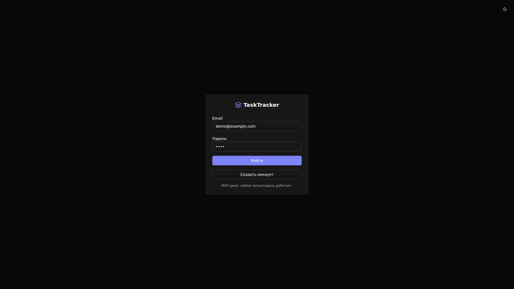

### Дашборд

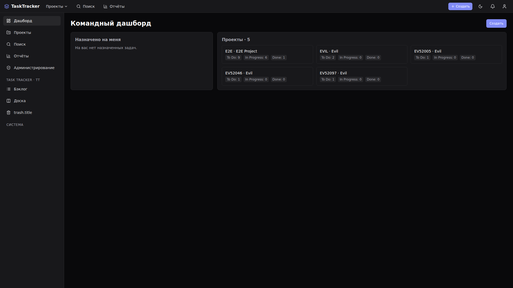

### Проекты

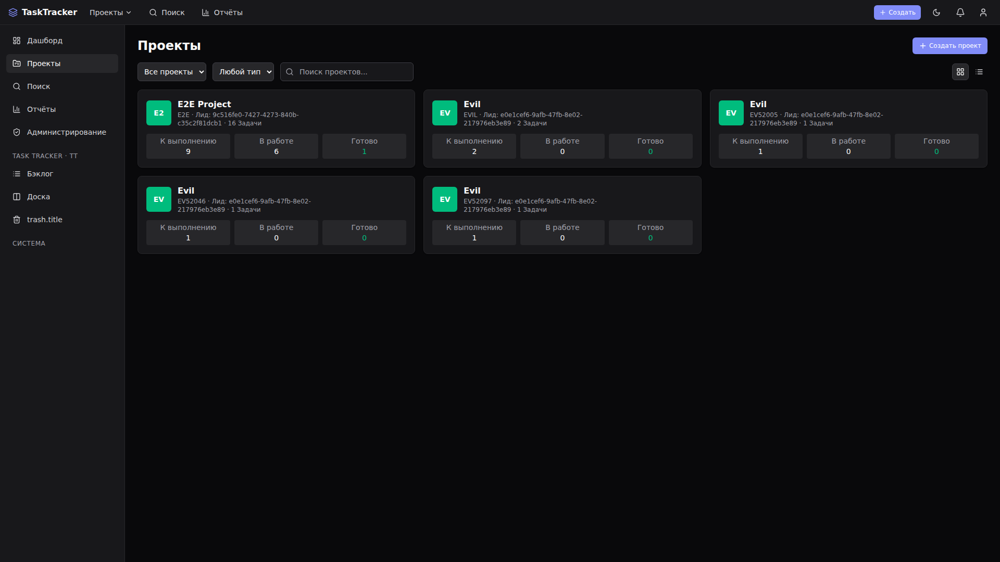

### Канбан-доска

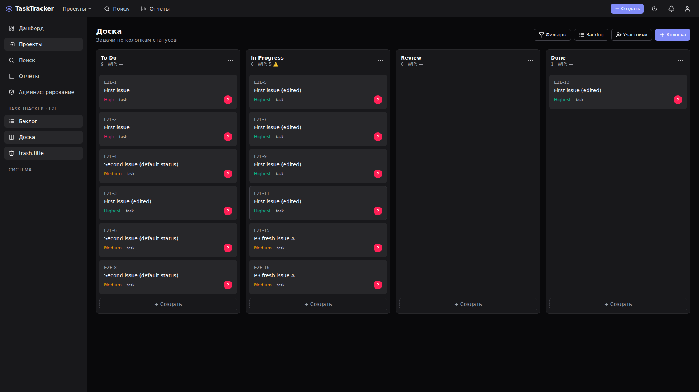

### Бэклог

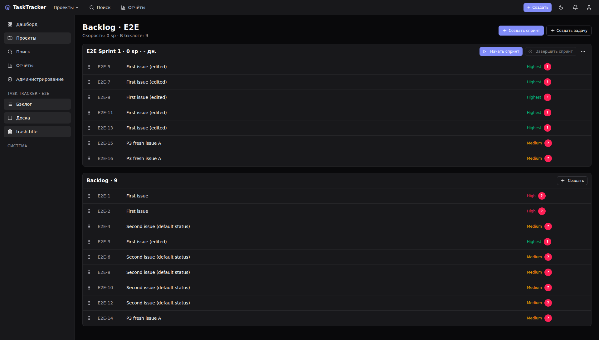

### Поиск

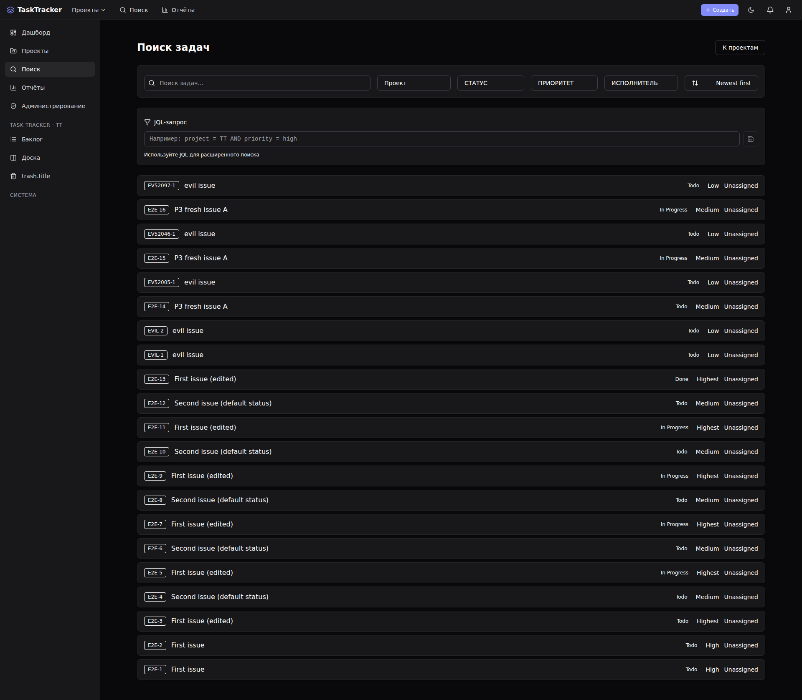

### Страница задачи

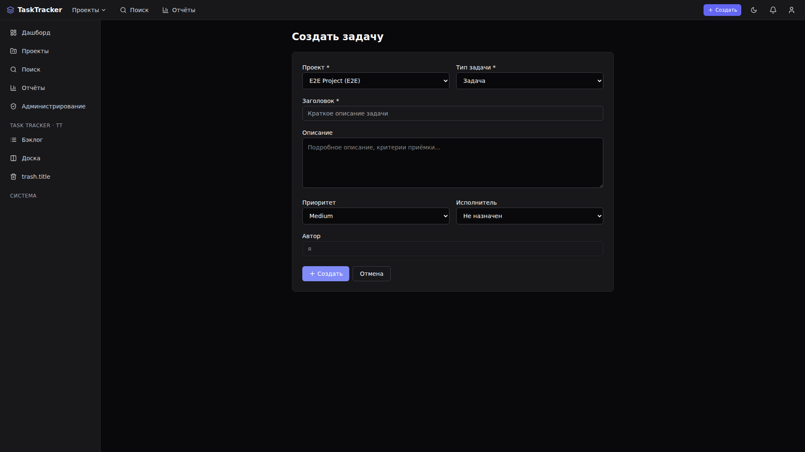

### Уведомления

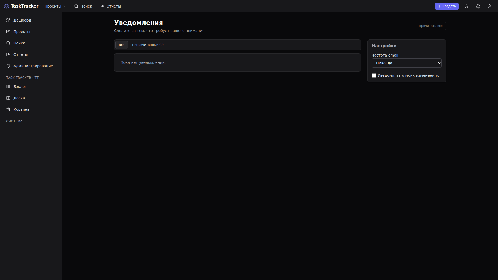

### Отчёты

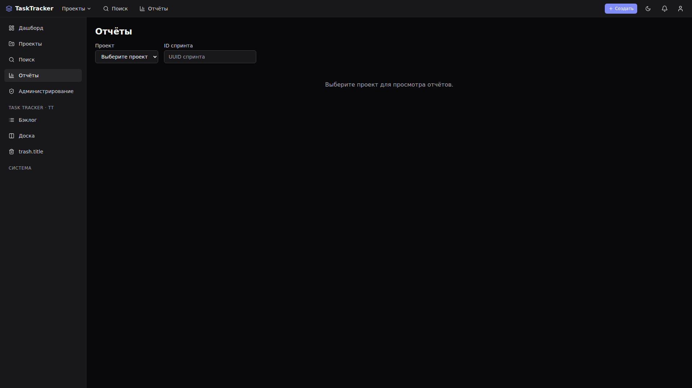

### Корзина

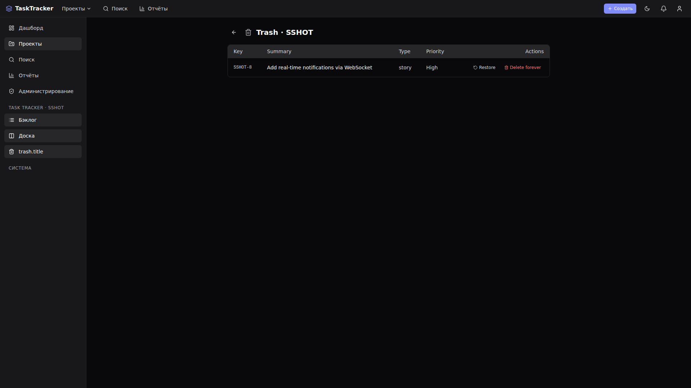

### Кастомные поля

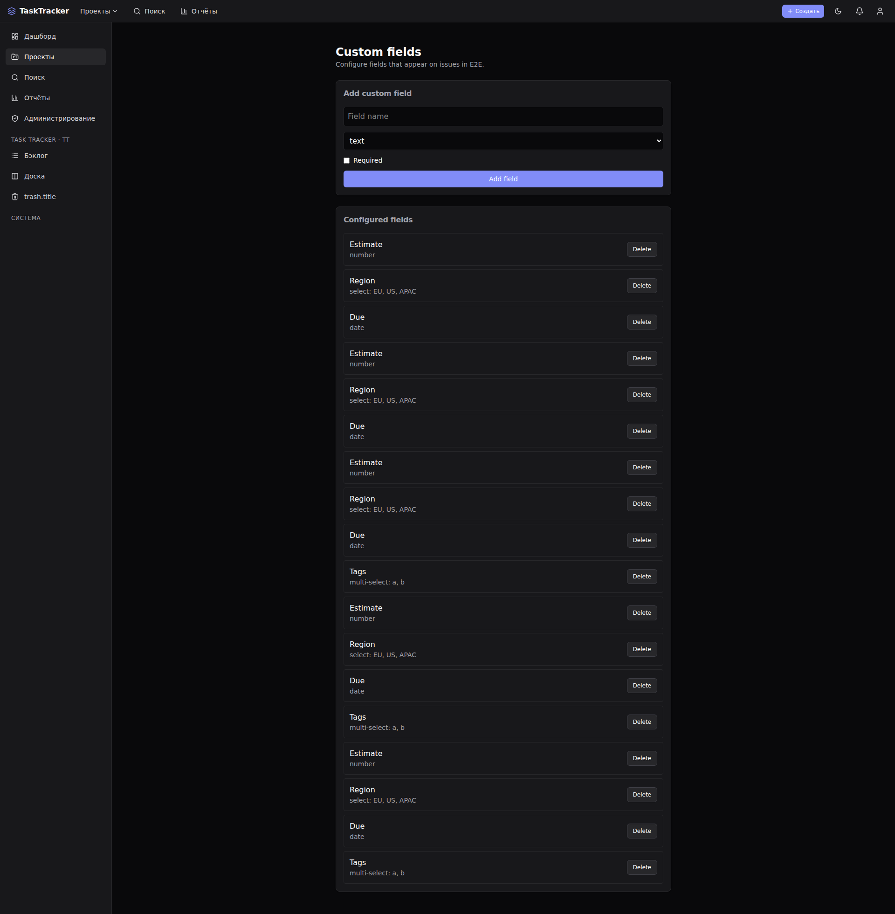

### Администрирование

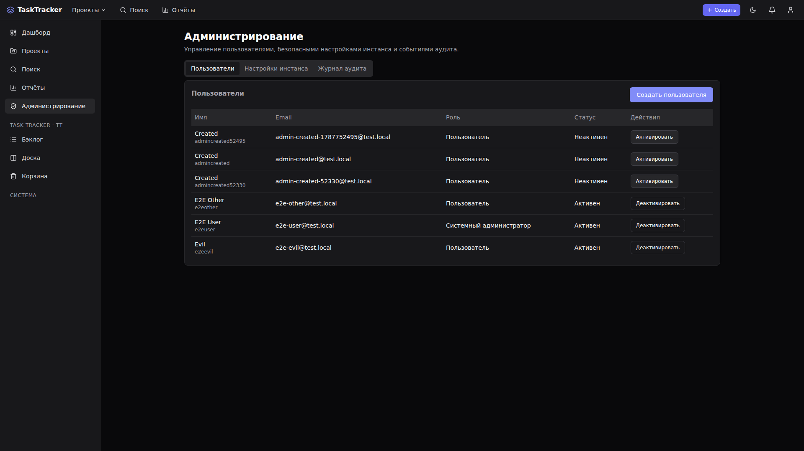

### Доска на мобильном

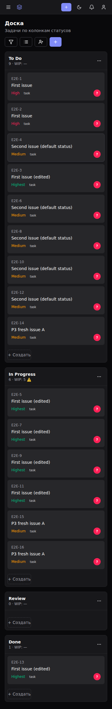

## Порты по умолчанию

| Сервис | Доступ | Описание |
|---|---|---|
| Frontend (docker) | `19877` | Nginx статика |
| Backend | `3456` | API |
| PostgreSQL | внутренний (compose-сеть) | БД, не публикуется наружу |
| Redis | внутренний (compose-сеть) | кеш, не публикуется наружу |

## Функциональность

### Проекты и задачи
- Проекты с канбан-досками, бэклогом, поиском, дашбордом
- Задачи: создание, редактирование, переход по статусам, комментарии, вложения
- Приоритеты, метки, типы задач, связи между задачами
- Назначение исполнителей, учёт времени (worklog)

### Канбан и спринты
- Канбан-доска с drag-and-drop колонками
- Спринты с планированием и отчётами
- Отчёты: velocity, burndown, cumulative flow, control chart

### Уведомления
- In-app notification center с непрочитанными
- SSE real-time push (NotificationCreated event)
- Email digest (hourly/daily background task, SMTP)
- Per-user настройки: email_frequency, disabled_event_types, notify_own_changes

### Watchers и голосования
- Watch: подписка на изменения задачи
- Vote: голосование за задачу, счётчик голосов

### Кастомные поля
- Project-level определения: text, number, select, multi-select, date
- Issue-level значения, required flag
- Управление через проектные настройки

### Компоненты и версии
- Project components (Frontend, Backend, Database, ...)
- Project versions (релизы/milestones с released/release_date)
- Issue: component, affected_version, fix_version

### Soft-delete и корзина
- Задачи помечаются `deleted_at` вместо удаления
- Корзина: восстановление и permanent purge

### CLI
- `task-tracker` binary — управление через API
- 12 групп команд: auth, project, issue, board, sprint, comment, label, search, notification, report, admin, member
- 3 формата вывода: json, table, compact
- Skill для AI-управления: `cli/SKILL.md`

### Администрирование
- Admin panel: users, instance settings, audit log
- Security headers, rate limiting, Prometheus metrics
- JQL-поиск.

## Быстрый старт

```bash
# 1. Скопировать env
cp .env.example .env
# замените POSTGRES_PASSWORD и TASKTRACKER_JWT_SECRET в .env
# TASKTRACKER_DATABASE__URL для Docker Compose оставьте закомментированным

# 2. Поднять инфраструктуру
docker compose up -d

# 3. Проверить API (backend host port по умолчанию слушает только localhost)
curl http://127.0.0.1:3456/api/v1/health

# 4. Frontend dev
cd frontend
pnpm install
pnpm generate:api
pnpm dev
```

Frontend dev откроется на `http://localhost:5173`, API проксируется через Vite dev server.

## CLI

```bash
# Сборка
cd backend && cargo build --bin task-tracker

# Использование
export TASKTRACKER_API_URL=http://localhost:3456/api/v1
export TASKTRACKER_TOKEN=<jwt_token>

./target/debug/task-tracker project list
./target/debug/task-tracker issue create --project-key DEMO --summary "Fix bug" --priority high
./target/debug/task-tracker issue list --project-key DEMO --output table
./target/debug/task-tracker board get --project-key DEMO
```

Документация команд: `cli/SKILL.md`.

## Команды

Основные команды завёрнуты в `justfile`:

| Команда | Описание |
|---|---|
| `just setup` | Установить зависимости backend + frontend |
| `just setup-env` | Создать `.env` из `.env.example` |
| `just db-up` | Поднять Docker Compose |
| `just db-down` | Остановить Docker Compose |
| `just backend-dev` | Поднять backend + БД в Docker |
| `just frontend-dev` | Запустить frontend dev server |
| `just test` | Unit + интеграционные тесты backend + frontend |
| `just e2e` | Playwright E2E тесты |
| `just gate` | CI-like gate: fmt-check, clippy, typecheck, тесты |
| `just build` | Собрать backend release + frontend production |
| `just api-codegen` | Перегенерировать `frontend/src/api/generated.ts` из OpenAPI |

## Смена порта

В `.env` измените host-порты, затем recreate сервисы:

```env
BACKEND_PORT=3456
FRONTEND_PORT=19877
```

```bash
docker compose up -d
```

Внутри compose-сети backend всегда слушает `3456`; PostgreSQL и Redis наружу не публикуются. Настройки backend используют формат `TASKTRACKER_SECTION__KEY` (например, `TASKTRACKER_SERVER__CORS_ALLOWED_ORIGINS`).

## Структура

- `backend/` — Rust workspace (`api`, `app`, `domain`, `infra`, `shared`, `server`, `cli`, `migration`)
- `frontend/` — React SPA (`src/pages/`, `src/api/`, `src/widgets/`)
- `cli/` — CLI binary + AI skill (`SKILL.md`)
- `openapi/` — канонический `openapi.json`
- `docs/` — архитектура, ТЗ, дата-модель, API, deployment, AGENTS.md

## Документы

- [Архитектура](docs/ARCHITECTURE.md)
- [Техническое задание](docs/TZ.md)
- [Дата-модель](docs/DATA_MODEL.md)
- [API](docs/API.md)
- [Deployment](docs/DEPLOYMENT.md)
- [Testing](docs/TESTING.md)
- [Roadmap](docs/ROADMAP.md)
- [AGENTS.md](docs/AGENTS.md)

## Лицензия

MIT.
