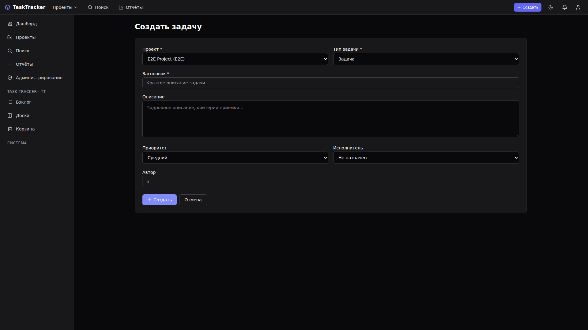
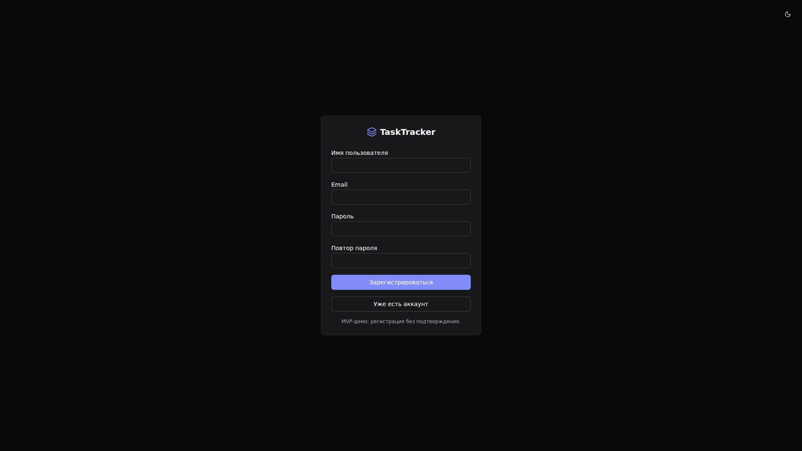
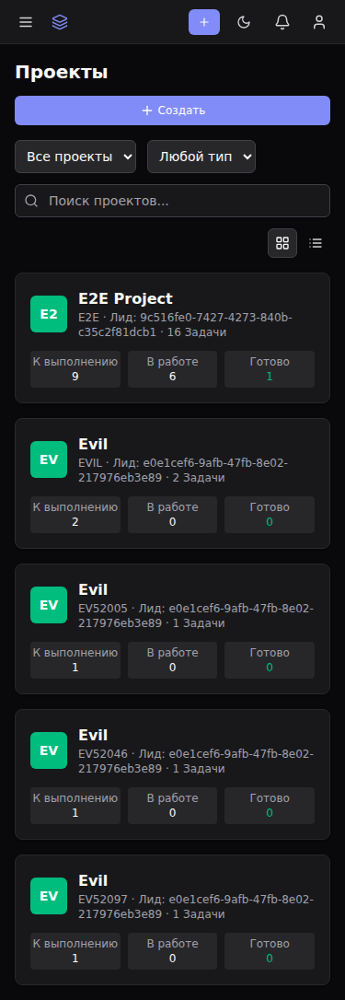
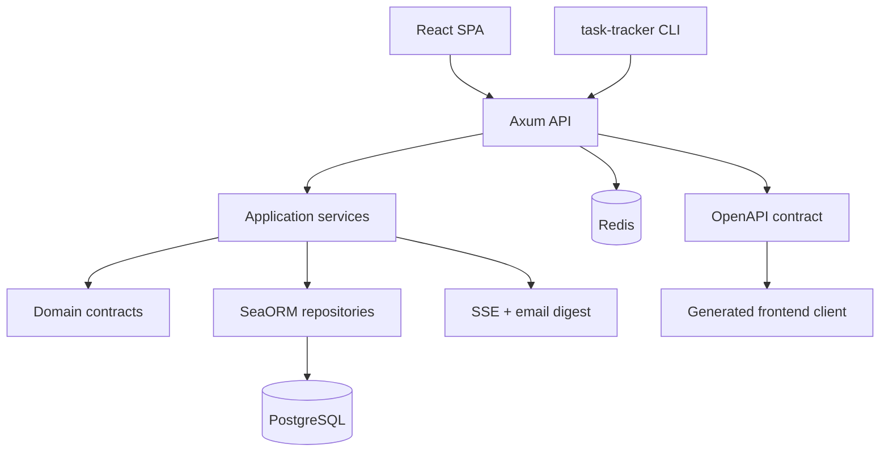

<p align="center">
  
</p>

<p align="center">
  <a href="#features"></a>
  <a href="#stack"></a>
  <a href="#screenshots"></a>
  <a href="#cli"></a>
  <a href="#architecture"></a>
  <a href="#quality"></a>
  <a href="#license"></a>
</p>

<p align="center">
  
  
  
  
  
  
  
  
</p>

---

## 🎯 Позиционирование

**Task Tracker** — self-hosted task tracker для FerrPOINT: проекты, задачи, kanban, backlog, sprints, comments, attachments, notifications, reports and admin tooling.

Это продуктовый MVP/hardening branch, а не hosted multi-tenant SaaS. Env-префикс: `TASKTRACKER_`.

## 📌 Snapshot

| Поле | Значение |
|---|---|
| Backend | Rust 2024, Axum, SeaORM |
| Data | PostgreSQL 17, Redis 8 |
| Frontend | React 19, Vite, Tailwind CSS |
| API | [openapi/openapi.json](openapi/openapi.json) |
| Ports | Frontend `19877`, backend `3456`, PostgreSQL/Redis internal |
| License | FerrPOINT Proprietary Source-Available Evaluation License v1.0 |

## 🚪 Default Ports

| Сервис | Доступ | Описание |
|---|---|---|
| Frontend Docker | `19877` | Nginx static frontend |
| Backend | `3456` | API |
| PostgreSQL | internal compose network | DB, not published externally |
| Redis | internal compose network | cache, not published externally |

<a name="features"></a>
## ✨ Features

| Feature | Описание |
|---|---|
| Projects and issues | Projects, members, issue detail, comments, attachments and search. |
| Planning | Kanban boards, backlog, sprints and worklog. |
| Metadata | Priorities, labels, issue types, links, watchers, votes, components and versions. |
| Reporting | Velocity, burndown, cumulative flow and control chart surfaces. |
| Notifications | In-app center, SSE push, email digest worker and per-user delivery settings. |
| Administration | Users, instance settings, audit log, security headers, rate limits and Prometheus metrics. |
| CLI | `task-tracker` binary with JSON/table/compact output. |

## 🧩 Capability Details

| Area | Details |
|---|---|
| Projects and issues | Projects with kanban boards, backlog, dashboard and search; issue create/edit/status transitions, comments, attachments, priorities, labels, issue types, links, assignees and worklog. |
| Kanban and sprints | Drag-and-drop board columns, sprint planning and reports: velocity, burndown, cumulative flow and control chart. |
| Notifications | In-app center, unread counters, SSE `NotificationCreated`, hourly/daily email digest, `email_frequency`, `disabled_event_types` and `notify_own_changes`. |
| Watchers and votes | Watch subscriptions, issue votes and vote counters. |
| Custom fields | Project-level text, number, select, multi-select and date fields with required flags and issue-level values. |
| Components and versions | Project components, release/milestone versions, `released`/`release_date`, affected/fix version links. |
| Soft delete | `deleted_at` trash model, restore and permanent purge. |
| Search/admin | JQL search, admin panel, users, instance settings, audit log, security headers, rate limiting and Prometheus metrics. |

<a name="stack"></a>
## 🔧 Core Stack

| Zone | Tech | Роль |
|---|---|---|
| API | Rust + Axum | HTTP routes, auth, DTO boundary |
| Domain/App | Rust workspace crates | services, policies and repository contracts |
| Persistence | SeaORM + PostgreSQL | runtime data and migrations |
| Cache/Push | Redis + SSE | cache and real-time delivery |
| Frontend | React + Vite + Tailwind | dashboard, boards and admin UI |
| Contract | OpenAPI | generated frontend API client |

## ⚡ Quick Start

```bash
cp .env.example .env
# Replace POSTGRES_PASSWORD and TASKTRACKER_JWT_SECRET in .env
docker compose up -d
curl http://127.0.0.1:3456/api/v1/health
```

Frontend dev:

```bash
cd frontend
pnpm install
pnpm generate:api
pnpm dev
```

Vite opens on `http://localhost:5173` and proxies API calls to the backend.

Port override:

```env
BACKEND_PORT=3456
FRONTEND_PORT=19877
```

After changing host ports, recreate services with `docker compose up -d`. Inside the compose network the backend still listens on `3456`; backend settings use the `TASKTRACKER_SECTION__KEY` format, for example `TASKTRACKER_SERVER__CORS_ALLOWED_ORIGINS`.

<a name="screenshots"></a>
## 🖼️ Screenshots

| Surface | Preview |
|---|---|
| Login |  |
| Dashboard |  |
| Projects |  |
| Kanban board |  |
| Backlog |  |
| Trash |  |
| Custom fields |  |
| Search |  |
| Notifications |  |
| Reports |  |
| Administration |  |
| Issue create |  |
| Issue detail |  |
| Register |  |
| Mobile board |  |
| Mobile projects |  |

<a name="cli"></a>
## 🖥️ CLI

```bash
cd backend
cargo build --bin task-tracker

export TASKTRACKER_API_URL=http://localhost:3456/api/v1
export TASKTRACKER_TOKEN=<jwt_token>

./target/debug/task-tracker project list
./target/debug/task-tracker issue create --project-key DEMO --summary "Fix bug" --priority high
./target/debug/task-tracker issue list --project-key DEMO --output table
./target/debug/task-tracker board get --project-key DEMO
```

CLI command documentation: [docs/CLI.md](docs/CLI.md). AI usage notes: [cli/SKILL.md](cli/SKILL.md).

<a name="architecture"></a>
## 🏗️ Architecture



## 🧱 Границы

- PostgreSQL and Redis are internal in Compose by default; expose them only deliberately.
- Before shared deployments, replace all `[CHANGE_ME]` values and review JWT, CORS, cookies, TLS and reverse-proxy settings.
- Generated frontend API code must be refreshed after OpenAPI changes.

<a name="quality"></a>
## 🛡️ Quality Bar

| Проверка | Команда |
|---|---|
| Setup | `just setup` |
| Dependencies | `just db-up` / `just db-down` |
| Backend dev | `just backend-dev` |
| Frontend dev | `just frontend-dev` |
| API codegen | `just api-codegen` |
| Test suite | `just test` |
| E2E | `just e2e` |
| CI-like gate | `just gate` |
| Build | `just build` |

## 🧭 Project Map

```text
task-tracker/
├── backend/     # Rust workspace: api, app, domain, infra, shared, server, cli, migration
├── frontend/    # React SPA: pages, widgets, generated API client
├── cli/         # CLI binary notes and agent skill
├── openapi/     # canonical API contract
├── docs/        # architecture, deployment, testing, roadmap
└── docker-compose.yml
```

## 📚 Документы

- [docs/ARCHITECTURE.md](docs/ARCHITECTURE.md) — architecture.
- [docs/TZ.md](docs/TZ.md) — technical specification.
- [docs/DATA_MODEL.md](docs/DATA_MODEL.md) — data model.
- [docs/API.md](docs/API.md) — API notes.
- [docs/DEPLOYMENT.md](docs/DEPLOYMENT.md) — deployment.
- [docs/TESTING.md](docs/TESTING.md) — checks.
- [docs/ROADMAP.md](docs/ROADMAP.md) — roadmap.
- [docs/AGENTS.md](docs/AGENTS.md) — agent instructions.

Screenshots live in [docs/screenshots](docs/screenshots).

<a name="license"></a>
## 🔒 License

Proprietary source-available. Not open source.

Viewing/evaluation only.

Commercial, production, resale, redistribution, SaaS/hosting use require written license from FerrPOINT. См. [LICENSE](LICENSE), [NOTICE](NOTICE) и [THIRD_PARTY_NOTICES.md](THIRD_PARTY_NOTICES.md).
