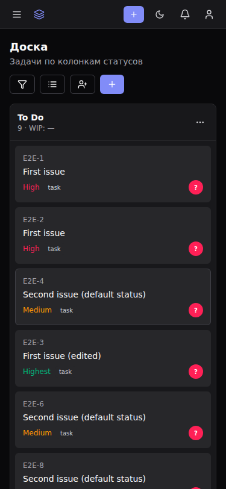
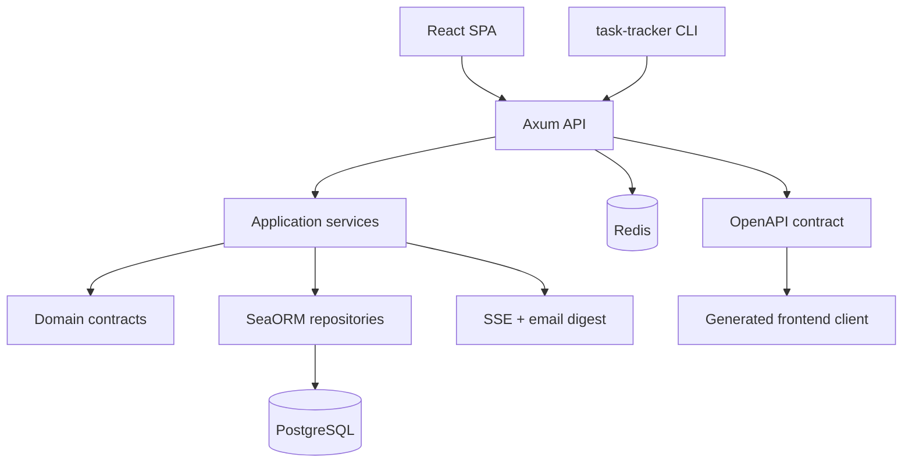

<p align="center">
  
</p>

<p align="center">
  <a href="#overview"></a>
  <a href="#capabilities"></a>
  <a href="#quick-start"></a>
  <a href="#visual-proof"></a>
  <a href="#cli"></a>
  <a href="#safety"></a>
  <a href="#quality"></a>
</p>

<p align="center">
  
  
  
  
  
  
  
</p>

---

> **Base Task Tracker** — self-hosted task tracker для FerrPOINT: проекты, задачи, kanban, backlog, sprints, comments, attachments, notifications, reports и admin tooling. Это продуктовый MVP/hardening branch, а не hosted multi-tenant SaaS. Env-префикс: `TASKTRACKER_`.

<a name="overview"></a>

## Обзор и Snapshot

| Поле | Значение |
|---|---|
| Backend | Rust 2024 workspace: api, app, domain, infra, shared, server, cli, migration |
| Data | PostgreSQL 17, Redis 8 |
| Frontend | React 19, Vite, Tailwind CSS |
| API | [openapi/openapi.json](openapi/openapi.json) — canonical contract |
| Порты | repository-local: frontend `19877`, backend `3456`; Base umbrella: frontend `7722`, API `7721`, PostgreSQL/Redis — loopback `7723`/`7724` |
| Identity | Локальная auth + TOTP MFA (RFC 6238, recovery codes); в Base umbrella — бридж к central auth |
| License | FerrPOINT Proprietary Source-Available Evaluation License v1.0 |

### Default Ports

| Сервис | Доступ | Описание |
|---|---|---|
| Frontend Docker | `19877` | Nginx static frontend |
| Backend | `3456` | API |
| PostgreSQL | internal compose network | DB, не публикуется наружу |
| Redis | internal compose network | cache, не публикуется наружу |

<a name="capabilities"></a>

## Возможности

| Feature | Описание |
|---|---|
| Projects and issues | Projects, members, issue detail, comments, attachments и search. |
| Planning | Kanban boards, backlog, sprints и worklog. |
| Metadata | Priorities, labels, issue types, links, watchers, votes, components и versions. |
| Reporting | Velocity, burndown, cumulative flow и control chart. |
| Notifications | In-app center, SSE push, email digest worker и per-user delivery settings. |
| Administration | Users, instance settings, audit log, security headers, rate limits и Prometheus metrics. |
| CLI | `task-tracker` binary с JSON/table/compact output. |

### Capability Details

| Area | Details |
|---|---|
| Projects and issues | Projects с kanban boards, backlog, dashboard и search; issue create/edit/status transitions, comments, attachments, priorities, labels, issue types, links, assignees и worklog. |
| Kanban and sprints | Drag-and-drop board columns, sprint planning и reports: velocity, burndown, cumulative flow и control chart. |
| Notifications | In-app center, unread counters, SSE `NotificationCreated`, hourly/daily email digest, `email_frequency`, `disabled_event_types` и `notify_own_changes`. |
| Watchers and votes | Watch subscriptions, issue votes и vote counters. |
| Custom fields | Project-level text, number, select, multi-select и date fields с required flags и issue-level values. |
| Components and versions | Project components, release/milestone versions, `released`/`release_date`, affected/fix version links. |
| Soft delete | `deleted_at` trash model, restore и permanent purge. |
| Search/admin | JQL search, admin panel, users, instance settings, audit log, security headers, rate limiting и Prometheus metrics. |

<a name="quick-start"></a>

## Быстрый старт

```bash
cp .env.example .env
# Задать POSTGRES_PASSWORD и TASKTRACKER_JWT_SECRET в .env
docker compose up --build -d
curl -fsS http://127.0.0.1:3456/api/v1/health
```

Frontend dev:

```bash
cd frontend
pnpm install
pnpm generate:api
pnpm dev
```

Vite открывает `http://localhost:5173` и проксирует API-вызовы на backend.

Port override:

```env
BACKEND_PORT=3456
FRONTEND_PORT=19877
```

После смены host-портов пересоздайте сервисы через `docker compose up -d`. Внутри compose-сети backend слушает `3456`; настройки backend используют формат `TASKTRACKER_SECTION__KEY`, например `TASKTRACKER_SERVER__CORS_ALLOWED_ORIGINS`.

Развернутые материалы: [docs/DEPLOYMENT.md](docs/DEPLOYMENT.md), [docs/ARCHITECTURE.md](docs/ARCHITECTURE.md), [docs/API.md](docs/API.md), [docs/CLI.md](docs/CLI.md).

<a name="visual-proof"></a>

## Визуальные доказательства

Скриншоты — реальные поверхности продукта с детерминированными seeded-данными. Формат: desktop full-page и обязательные mobile-свидетельства `375x812`.

### Дашборд


### Проекты


### Канбан-доска


### Бэклог


### Поиск


### Уведомления


### Отчёты


### Администрирование


### Кастомные поля


### Корзина


### Доска на мобильном



Доска на `375x812` намеренно превращается в вертикальный стек карточек; колонки с большим числом карточек остаются scroll-heavy by design.

### Мобильный интерфейс (375×812)

 

Полная route-галерея (включая login/register и issue detail) — в [docs/screenshots](docs/screenshots).

<a name="cli"></a>

## CLI

```bash
cd backend
cargo build --bin task-tracker

export TASKTRACKER_API_URL=http://localhost:3456/api/v1
export TASKTRACKER_TOKEN=<jwt_token>

./target/debug/task-tracker project list
./target/debug/task-tracker issue create --project-key DEMO --summary "Fix bug" --priority high
./target/debug/task-tracker issue list --project-key DEMO --output table
./target/debug/task-tracker board get --project-key DEMO
```

CLI command documentation: [docs/CLI.md](docs/CLI.md). AI usage notes: [cli/SKILL.md](cli/SKILL.md).

## Архитектура



<a name="safety"></a>

## Границы

- PostgreSQL и Redis внутренние в Compose по умолчанию; публикуйте их только осознанно.
- Перед shared deployments замените все `[CHANGE_ME]` значения и проверьте JWT, CORS, cookies, TLS и reverse-proxy настройки.
- Сгенерированный frontend API-код обязан обновляться после изменений OpenAPI.
- `/api/v1/health` — liveness; не выводите готовность БД, Redis, email или central-auth из успешного liveness-ответа.

<a name="quality"></a>

## Качество и проверки

| Проверка | Команда |
|---|---|
| README contract tests | `python3 -m unittest scripts.tests.test_verify_readme -v` |
| README assets и anchors | `python3 scripts/verify_readme.py` |
| Setup / dependencies | `just setup` / `just db-up` / `just db-down` |
| Backend dev | `just backend-dev` |
| Frontend dev | `just frontend-dev` |
| API codegen | `just api-codegen` |
| Backend workspace | `cd backend && cargo fmt --all -- --check && cargo clippy --workspace --all-targets -- -D warnings && cargo test --workspace -- --test-threads=1` |
| Frontend | `cd frontend && pnpm openapi:check && pnpm typecheck && pnpm test -- --run && pnpm lint && pnpm build` |
| Browser E2E | `cd frontend && pnpm test:e2e -- --project=chromium` |
| Compose contract | `docker compose config -q` |
| Full gates | `just gate` / `just test` / `just e2e` |

GitHub Actions прогоняет docs-гейт, backend fmt/clippy/tests, OpenAPI drift и frontend gates (typecheck/tests/lint/build). Browser E2E и тяжёлые проверки запускаются локально по необходимости.

## Карта проекта

```text
task-tracker/
├── backend/     # Rust workspace: api, app, domain, infra, shared, server, cli, migration
├── frontend/    # React SPA: pages, widgets, generated API client
├── cli/         # CLI binary notes и agent skill
├── openapi/     # canonical API contract
├── docs/        # architecture, deployment, testing, roadmap
└── docker-compose.yml
```

## Документы

- [docs/ARCHITECTURE.md](docs/ARCHITECTURE.md) — архитектура.
- [docs/TZ.md](docs/TZ.md) — техническое задание.
- [docs/DATA_MODEL.md](docs/DATA_MODEL.md) — модель данных.
- [docs/API.md](docs/API.md) — API notes.
- [docs/DEPLOYMENT.md](docs/DEPLOYMENT.md) — deployment.
- [docs/TESTING.md](docs/TESTING.md) — проверки.
- [docs/ROADMAP.md](docs/ROADMAP.md) — roadmap.
- [docs/AGENTS.md](docs/AGENTS.md) — agent instructions.

<a name="license"></a>

## Лицензия

Proprietary source-available. Not open source. Viewing/evaluation only.

Commercial, production, resale, redistribution, SaaS/hosting use require written license from FerrPOINT. См. [LICENSE](LICENSE), [NOTICE](NOTICE) и [THIRD_PARTY_NOTICES.md](THIRD_PARTY_NOTICES.md).
