# Дата-модель Task Tracker

## 1. Общие принципы

- PostgreSQL 17.
- UUID v7 для большинства PK (сортируемый по времени).
- JSONB для гибких схем (workflow, field config, dashboard layout, custom field values).
- Все timestamp с timezone (`timestamptz`).
- Soft delete на уровне `deleted_at` для сущностей, где нужен trash.
- Row-level security не используем; проверки RBAC в коде.
- Нормализация + JSONB гибрид: схемы и workflow храним в JSONB, основные сущности — в таблицах.

---

## 2. Список сущностей

### Пользователи и безопасность
1. `users`
2. `user_sessions`
3. `refresh_tokens`
4. `password_reset_tokens`
5. `audit_log`

### Глобальные схемы и справочники
6. `issue_types`
7. `statuses`
8. `workflows`
9. `workflow_statuses`
10. `workflow_transitions`
11. `transition_conditions`
12. `transition_validators`
13. `transition_post_functions`
14. `permission_schemes`
15. `permission_scheme_entries`
16. `notification_schemes`
17. `notification_scheme_events`
18. `field_configurations`
19. `field_configuration_items`
20. `screens`
21. `screen_tabs`
22. `screen_fields`
23. `issue_type_screen_schemes`
24. `issue_type_screen_scheme_entries`
25. `workflow_schemes`
26. `workflow_scheme_entries`
27. `issue_type_schemes`
28. `issue_type_scheme_entries`

### Проекты
29. `projects`
30. `project_issue_counter`
31. `project_members`
32. `project_role_assignments`
33. `project_settings`
34. `components`
35. `versions`
36. `project_scheme_bindings`

### Задачи
37. `issues`
38. `issue_status_history`
39. `issue_assignee_history`
40. `issue_labels`
41. `issue_components`
42. `issue_fix_versions`
43. `issue_affected_versions`
44. `issue_custom_field_values`
45. `issue_watchers`
46. `issue_votes`
47. `issue_trash`

### Связи задач
48. `issue_link_types`
49. `issue_links`

### Аудит и история изменений

73. `changelog`
74. `audit_log`

### Вложения
75. `attachments`

### Time tracking
54. `worklogs`

### Kanban / Scrum
55. `boards`
56. `board_columns`
57. `board_quick_filters`
58. `sprints`
59. `sprint_issues`
60. `sprint_reports`

### Кастомные поля
61. `custom_fields`
62. `custom_field_contexts`
63. `custom_field_context_projects`
64. `custom_field_context_issue_types`
65. `custom_field_options`

### Фильтры и дашборды
66. `saved_filters`
67. `filter_subscriptions`
68. `dashboards`
69. `dashboard_gadgets`

### Уведомления
70. `notifications`
71. `notification_user_settings`
72. `project_watches`
73. `issue_watches`

### Автоматизация
74. `automation_rules`
75. `automation_rule_logs`

---

## 3. ER-диаграмма (Mermaid)

```mermaid
erDiagram
    USERS ||--o{ PROJECTS : leads
    USERS ||--o{ PROJECT_MEMBERS : member
    PROJECTS ||--|| PROJECT_ISSUE_COUNTER : counter
    PROJECTS ||--o{ ISSUES : contains
    PROJECTS ||--o{ BOARDS : has
    PROJECTS ||--o{ SPRINTS : has
    PROJECTS ||--o{ VERSIONS : has
    PROJECTS ||--o{ COMPONENTS : has
    PROJECTS ||--|| PROJECT_SCHEME_BINDINGS : binds

    ISSUE_TYPES ||--o{ ISSUES : typed_as
    STATUSES ||--o{ ISSUES : current_status
    WORKFLOWS ||--o{ WORKFLOW_STATUSES : has
    WORKFLOWS ||--o{ WORKFLOW_TRANSITIONS : has
    WORKFLOW_STATUSES ||--o{ WORKFLOW_TRANSITIONS : from
    WORKFLOW_STATUSES ||--o{ WORKFLOW_TRANSITIONS : to
    WORKFLOW_TRANSITIONS ||--o{ TRANSITION_CONDITIONS : has
    WORKFLOW_TRANSITIONS ||--o{ TRANSITION_VALIDATORS : has
    WORKFLOW_TRANSITIONS ||--o{ TRANSITION_POST_FUNCTIONS : has

    WORKFLOW_SCHEMES ||--o{ WORKFLOW_SCHEME_ENTRIES : maps
    WORKFLOW_SCHEME_ENTRIES ||--o{ WORKFLOWS : workflow
    WORKFLOW_SCHEME_ENTRIES ||--o{ ISSUE_TYPES : issue_type

    ISSUE_TYPE_SCHEMES ||--o{ ISSUE_TYPE_SCHEME_ENTRIES : contains
    ISSUE_TYPE_SCHEME_ENTRIES ||--o{ ISSUE_TYPES : issue_type

    ISSUES ||--o{ ISSUE_LABELS : labels
    ISSUES ||--o{ ISSUE_COMPONENTS : components
    ISSUES ||--o{ ISSUE_FIX_VERSIONS : fix_versions
    ISSUES ||--o{ ISSUE_AFFECTED_VERSIONS : affected_versions
    ISSUES ||--o{ ISSUE_CUSTOM_FIELD_VALUES : custom_fields
    ISSUES ||--o{ ISSUE_LINKS : linked
    ISSUES ||--o{ COMMENTS : comments
    ISSUES ||--o{ ATTACHMENTS : attachments
    ISSUES ||--o{ WORKLOGS : worklogs
    ISSUES ||--o{ ISSUE_STATUS_HISTORY : status_history
    ISSUES ||--o{ ISSUE_ASSIGNEE_HISTORY : assignee_history
    ISSUES ||--o{ ISSUE_WATCHERS : watchers
    ISSUES ||--o{ ISSUE_VOTES : votes
    ISSUES ||--o{ ACTIVITY_LOG : activity

    USERS ||--o{ ISSUES : assignee
    USERS ||--o{ ISSUES : reporter
    USERS ||--o{ COMMENTS : author
    USERS ||--o{ WORKLOGS : worker
    USERS ||--o{ NOTIFICATIONS : recipient
    USERS ||--o{ SAVED_FILTERS : owner
    USERS ||--o{ DASHBOARDS : owner

    SPRINTS ||--o{ SPRINT_ISSUES : contains
    ISSUES ||--o{ SPRINT_ISSUES : in_sprint

    CUSTOM_FIELDS ||--o{ CUSTOM_FIELD_CONTEXTS : contexts
    CUSTOM_FIELDS ||--o{ CUSTOM_FIELD_OPTIONS : options
    CUSTOM_FIELDS ||--o{ ISSUE_CUSTOM_FIELD_VALUES : values

    SAVED_FILTERS ||--o{ DASHBOARD_GADGETS : source
    DASHBOARDS ||--o{ DASHBOARD_GADGETS : contains

    PERMISSION_SCHEMES ||--o{ PERMISSION_SCHEME_ENTRIES : entries
    NOTIFICATION_SCHEMES ||--o{ NOTIFICATION_SCHEME_EVENTS : events
```

---

## 4. Таблицы

### 4.1. users

```sql
CREATE TABLE users (
    id UUID PRIMARY KEY DEFAULT gen_random_uuid(),
    username CITEXT UNIQUE NOT NULL,
    email CITEXT UNIQUE NOT NULL,
    password_hash TEXT NOT NULL,
    display_name TEXT NOT NULL,
    avatar_url TEXT,
    timezone TEXT DEFAULT 'Europe/Moscow',
    locale TEXT DEFAULT 'ru',
    theme TEXT DEFAULT 'dark',
    is_active BOOLEAN DEFAULT true,
    is_admin BOOLEAN DEFAULT false,
    email_verified_at TIMESTAMPTZ,
    last_login_at TIMESTAMPTZ,
    created_at TIMESTAMPTZ DEFAULT now(),
    updated_at TIMESTAMPTZ DEFAULT now()
);
```

Индексы: `username`, `email`, `is_active`.

### 4.2. user_sessions

```sql
CREATE TABLE user_sessions (
    id UUID PRIMARY KEY DEFAULT gen_random_uuid(),
    user_id UUID NOT NULL REFERENCES users(id) ON DELETE CASCADE,
    refresh_token_hash TEXT NOT NULL,
    ip_address INET,
    user_agent TEXT,
    expires_at TIMESTAMPTZ NOT NULL,
    created_at TIMESTAMPTZ DEFAULT now(),
    UNIQUE(user_id, refresh_token_hash)
);
```

### 4.3. password_reset_tokens

```sql
CREATE TABLE password_reset_tokens (
    id UUID PRIMARY KEY DEFAULT gen_random_uuid(),
    user_id UUID NOT NULL REFERENCES users(id) ON DELETE CASCADE,
    token_hash TEXT NOT NULL,
    expires_at TIMESTAMPTZ NOT NULL,
    used_at TIMESTAMPTZ,
    created_at TIMESTAMPTZ DEFAULT now()
);
```

### 4.4. audit_log

```sql
CREATE TABLE audit_log (
    id UUID PRIMARY KEY DEFAULT gen_random_uuid(),
    actor_id UUID REFERENCES users(id),
    action TEXT NOT NULL,
    entity_type TEXT NOT NULL,
    entity_id UUID,
    changes JSONB,
    ip_address INET,
    user_agent TEXT,
    created_at TIMESTAMPTZ DEFAULT now()
);
```

Индекс: `created_at DESC`, `entity_type`, `entity_id`.

---

### 4.5. issue_types

```sql
CREATE TABLE issue_types (
    id UUID PRIMARY KEY DEFAULT gen_random_uuid(),
    name TEXT NOT NULL,
    description TEXT,
    icon_url TEXT,
    color TEXT,
    is_subtask BOOLEAN DEFAULT false,
    is_hierarchy_level INTEGER DEFAULT 0,
    is_system BOOLEAN DEFAULT false,
    is_active BOOLEAN DEFAULT true,
    created_at TIMESTAMPTZ DEFAULT now()
);
```

Seed: Task, Bug, Story, Epic, Sub-task.

### 4.6. statuses

```sql
CREATE TABLE statuses (
    id UUID PRIMARY KEY DEFAULT gen_random_uuid(),
    name TEXT NOT NULL,
    description TEXT,
    category TEXT NOT NULL CHECK (category IN ('todo','in_progress','done')),
    color TEXT,
    icon TEXT,
    is_system BOOLEAN DEFAULT false,
    is_active BOOLEAN DEFAULT true,
    created_at TIMESTAMPTZ DEFAULT now()
);
```

Seed: To Do, In Progress, In Review, Done, Cancelled, Reopened.

### 4.7. workflows

```sql
CREATE TABLE workflows (
    id UUID PRIMARY KEY DEFAULT gen_random_uuid(),
    name TEXT NOT NULL,
    description TEXT,
    is_system BOOLEAN DEFAULT false,
    is_active BOOLEAN DEFAULT true,
    created_at TIMESTAMPTZ DEFAULT now(),
    updated_at TIMESTAMPTZ DEFAULT now()
);
```

### 4.8. workflow_statuses

```sql
CREATE TABLE workflow_statuses (
    id UUID PRIMARY KEY DEFAULT gen_random_uuid(),
    workflow_id UUID NOT NULL REFERENCES workflows(id) ON DELETE CASCADE,
    status_id UUID NOT NULL REFERENCES statuses(id),
    is_start BOOLEAN DEFAULT false,
    is_final BOOLEAN DEFAULT false,
    position INTEGER DEFAULT 0,
    UNIQUE(workflow_id, status_id)
);
```

### 4.9. workflow_transitions

```sql
CREATE TABLE workflow_transitions (
    id UUID PRIMARY KEY DEFAULT gen_random_uuid(),
    workflow_id UUID NOT NULL REFERENCES workflows(id) ON DELETE CASCADE,
    name TEXT NOT NULL,
    from_status_id UUID REFERENCES statuses(id),
    to_status_id UUID NOT NULL REFERENCES statuses(id),
    screen_id UUID REFERENCES screens(id),
    position INTEGER DEFAULT 0,
    is_global BOOLEAN DEFAULT false,
    created_at TIMESTAMPTZ DEFAULT now()
);
```

`from_status_id IS NULL` означает глобальный переход (например, Reopen).

### 4.10. transition_conditions

```sql
CREATE TABLE transition_conditions (
    id UUID PRIMARY KEY DEFAULT gen_random_uuid(),
    transition_id UUID NOT NULL REFERENCES workflow_transitions(id) ON DELETE CASCADE,
    condition_type TEXT NOT NULL, -- 'permission','role','assignee','field_value','expression'
    config JSONB NOT NULL,
    position INTEGER DEFAULT 0
);
```

### 4.11. transition_validators

```sql
CREATE TABLE transition_validators (
    id UUID PRIMARY KEY DEFAULT gen_random_uuid(),
    transition_id UUID NOT NULL REFERENCES workflow_transitions(id) ON DELETE CASCADE,
    validator_type TEXT NOT NULL, -- 'field_required','expression','linked_issue_status'
    config JSONB NOT NULL,
    position INTEGER DEFAULT 0
);
```

### 4.12. transition_post_functions

```sql
CREATE TABLE transition_post_functions (
    id UUID PRIMARY KEY DEFAULT gen_random_uuid(),
    transition_id UUID NOT NULL REFERENCES workflow_transitions(id) ON DELETE CASCADE,
    function_type TEXT NOT NULL, -- 'set_field','add_comment','send_notification','trigger_event','create_subtask','call_webhook'
    config JSONB NOT NULL,
    position INTEGER DEFAULT 0
);
```

---

### 4.13. permission_schemes

```sql
CREATE TABLE permission_schemes (
    id UUID PRIMARY KEY DEFAULT gen_random_uuid(),
    name TEXT NOT NULL,
    description TEXT,
    is_system BOOLEAN DEFAULT false,
    created_at TIMESTAMPTZ DEFAULT now()
);
```

### 4.14. permission_scheme_entries

```sql
CREATE TABLE permission_scheme_entries (
    id UUID PRIMARY KEY DEFAULT gen_random_uuid(),
    scheme_id UUID NOT NULL REFERENCES permission_schemes(id) ON DELETE CASCADE,
    permission_key TEXT NOT NULL,
    grantee_type TEXT NOT NULL, -- 'user','role','group','project_role','anyone'
    grantee_id UUID,
    created_at TIMESTAMPTZ DEFAULT now(),
    UNIQUE(scheme_id, permission_key, grantee_type, grantee_id)
);
```

### 4.15. notification_schemes

```sql
CREATE TABLE notification_schemes (
    id UUID PRIMARY KEY DEFAULT gen_random_uuid(),
    name TEXT NOT NULL,
    description TEXT,
    is_system BOOLEAN DEFAULT false,
    created_at TIMESTAMPTZ DEFAULT now()
);
```

### 4.16. notification_scheme_events

```sql
CREATE TABLE notification_scheme_events (
    id UUID PRIMARY KEY DEFAULT gen_random_uuid(),
    scheme_id UUID NOT NULL REFERENCES notification_schemes(id) ON DELETE CASCADE,
    event_type TEXT NOT NULL, -- 'issue_created','issue_updated','status_changed','comment_added','mention'
    recipient_type TEXT NOT NULL, -- 'current_user','assignee','reporter','watchers','project_role','group','mentioned'
    recipient_id UUID,
    template_id UUID,
    delay_minutes INTEGER DEFAULT 0,
    created_at TIMESTAMPTZ DEFAULT now()
);
```

### 4.17. field_configurations

```sql
CREATE TABLE field_configurations (
    id UUID PRIMARY KEY DEFAULT gen_random_uuid(),
    name TEXT NOT NULL,
    description TEXT,
    is_system BOOLEAN DEFAULT false,
    created_at TIMESTAMPTZ DEFAULT now()
);
```

### 4.18. field_configuration_items

```sql
CREATE TABLE field_configuration_items (
    id UUID PRIMARY KEY DEFAULT gen_random_uuid(),
    configuration_id UUID NOT NULL REFERENCES field_configurations(id) ON DELETE CASCADE,
    field_type TEXT NOT NULL, -- 'system' | 'custom'
    field_id UUID NOT NULL, -- issue_type_id или custom_field_id
    is_hidden BOOLEAN DEFAULT false,
    is_required BOOLEAN DEFAULT false,
    is_readonly BOOLEAN DEFAULT false,
    default_value JSONB,
    render_config JSONB
);
```

### 4.19. screens

```sql
CREATE TABLE screens (
    id UUID PRIMARY KEY DEFAULT gen_random_uuid(),
    name TEXT NOT NULL,
    description TEXT,
    is_system BOOLEAN DEFAULT false,
    created_at TIMESTAMPTZ DEFAULT now()
);
```

### 4.20. screen_tabs

```sql
CREATE TABLE screen_tabs (
    id UUID PRIMARY KEY DEFAULT gen_random_uuid(),
    screen_id UUID NOT NULL REFERENCES screens(id) ON DELETE CASCADE,
    name TEXT NOT NULL,
    position INTEGER DEFAULT 0
);
```

### 4.21. screen_fields

```sql
CREATE TABLE screen_fields (
    id UUID PRIMARY KEY DEFAULT gen_random_uuid(),
    screen_tab_id UUID NOT NULL REFERENCES screen_tabs(id) ON DELETE CASCADE,
    field_type TEXT NOT NULL, -- 'system' | 'custom'
    field_id UUID NOT NULL,
    position INTEGER DEFAULT 0,
    is_required BOOLEAN DEFAULT false
);
```

### 4.22. issue_type_screen_schemes

```sql
CREATE TABLE issue_type_screen_schemes (
    id UUID PRIMARY KEY DEFAULT gen_random_uuid(),
    name TEXT NOT NULL,
    description TEXT,
    is_system BOOLEAN DEFAULT false,
    created_at TIMESTAMPTZ DEFAULT now()
);
```

### 4.23. issue_type_screen_scheme_entries

```sql
CREATE TABLE issue_type_screen_scheme_entries (
    id UUID PRIMARY KEY DEFAULT gen_random_uuid(),
    scheme_id UUID NOT NULL REFERENCES issue_type_screen_schemes(id) ON DELETE CASCADE,
    issue_type_id UUID REFERENCES issue_types(id),
    screen_id UUID NOT NULL REFERENCES screens(id),
    operation TEXT NOT NULL, -- 'create','edit','view'
    UNIQUE(scheme_id, issue_type_id, operation)
);
```

### 4.24. workflow_schemes

```sql
CREATE TABLE workflow_schemes (
    id UUID PRIMARY KEY DEFAULT gen_random_uuid(),
    name TEXT NOT NULL,
    description TEXT,
    is_system BOOLEAN DEFAULT false,
    created_at TIMESTAMPTZ DEFAULT now()
);
```

### 4.25. workflow_scheme_entries

```sql
CREATE TABLE workflow_scheme_entries (
    id UUID PRIMARY KEY DEFAULT gen_random_uuid(),
    scheme_id UUID NOT NULL REFERENCES workflow_schemes(id) ON DELETE CASCADE,
    issue_type_id UUID REFERENCES issue_types(id),
    workflow_id UUID NOT NULL REFERENCES workflows(id),
    UNIQUE(scheme_id, issue_type_id)
);
```

### 4.26. issue_type_schemes

```sql
CREATE TABLE issue_type_schemes (
    id UUID PRIMARY KEY DEFAULT gen_random_uuid(),
    name TEXT NOT NULL,
    description TEXT,
    is_system BOOLEAN DEFAULT false,
    created_at TIMESTAMPTZ DEFAULT now()
);
```

### 4.27. issue_type_scheme_entries

```sql
CREATE TABLE issue_type_scheme_entries (
    id UUID PRIMARY KEY DEFAULT gen_random_uuid(),
    scheme_id UUID NOT NULL REFERENCES issue_type_schemes(id) ON DELETE CASCADE,
    issue_type_id UUID NOT NULL REFERENCES issue_types(id),
    position INTEGER DEFAULT 0,
    UNIQUE(scheme_id, issue_type_id)
);
```

---

### 4.28. projects

```sql
CREATE TABLE projects (
    id UUID PRIMARY KEY DEFAULT gen_random_uuid(),
    key CITEXT UNIQUE NOT NULL,
    name TEXT NOT NULL,
    description TEXT,
    project_type TEXT NOT NULL CHECK (project_type IN ('basic','kanban','scrum')),
    lead_id UUID NOT NULL REFERENCES users(id),
    default_assignee_type TEXT DEFAULT 'project_lead', -- 'project_lead','unassigned'
    avatar_url TEXT,
    status TEXT DEFAULT 'active', -- 'active','archived'
    created_at TIMESTAMPTZ DEFAULT now(),
    updated_at TIMESTAMPTZ DEFAULT now()
);
```

### 4.29. project_issue_counter

```sql
CREATE TABLE project_issue_counter (
    project_id UUID PRIMARY KEY REFERENCES projects(id) ON DELETE CASCADE,
    current_value BIGINT DEFAULT 0
);
```

### 4.30. project_members

```sql
CREATE TABLE project_members (
    id UUID PRIMARY KEY DEFAULT gen_random_uuid(),
    project_id UUID NOT NULL REFERENCES projects(id) ON DELETE CASCADE,
    user_id UUID NOT NULL REFERENCES users(id) ON DELETE CASCADE,
    joined_at TIMESTAMPTZ DEFAULT now(),
    UNIQUE(project_id, user_id)
);
```

### 4.31. project_role_assignments

```sql
CREATE TABLE project_role_assignments (
    id UUID PRIMARY KEY DEFAULT gen_random_uuid(),
    project_id UUID NOT NULL REFERENCES projects(id) ON DELETE CASCADE,
    user_id UUID NOT NULL REFERENCES users(id) ON DELETE CASCADE,
    role_name TEXT NOT NULL, -- 'admin','manager','developer','tester','viewer'
    assigned_by UUID REFERENCES users(id),
    created_at TIMESTAMPTZ DEFAULT now(),
    UNIQUE(project_id, user_id, role_name)
);
```

### 4.32. project_scheme_bindings

```sql
CREATE TABLE project_scheme_bindings (
    id UUID PRIMARY KEY DEFAULT gen_random_uuid(),
    project_id UUID NOT NULL UNIQUE REFERENCES projects(id) ON DELETE CASCADE,
    workflow_scheme_id UUID NOT NULL REFERENCES workflow_schemes(id),
    issue_type_scheme_id UUID NOT NULL REFERENCES issue_type_schemes(id),
    field_configuration_scheme_id UUID NOT NULL,
    screen_scheme_id UUID NOT NULL REFERENCES issue_type_screen_schemes(id),
    permission_scheme_id UUID NOT NULL REFERENCES permission_schemes(id),
    notification_scheme_id UUID NOT NULL REFERENCES notification_schemes(id)
);
```

### 4.33. components

```sql
CREATE TABLE components (
    id UUID PRIMARY KEY DEFAULT gen_random_uuid(),
    project_id UUID NOT NULL REFERENCES projects(id) ON DELETE CASCADE,
    name TEXT NOT NULL,
    description TEXT,
    lead_id UUID REFERENCES users(id),
    default_assignee_id UUID REFERENCES users(id),
    created_at TIMESTAMPTZ DEFAULT now(),
    UNIQUE(project_id, name)
);
```

### 4.34. versions

```sql
CREATE TABLE versions (
    id UUID PRIMARY KEY DEFAULT gen_random_uuid(),
    project_id UUID NOT NULL REFERENCES projects(id) ON DELETE CASCADE,
    name TEXT NOT NULL,
    description TEXT,
    start_date DATE,
    release_date DATE,
    released BOOLEAN DEFAULT false,
    archived BOOLEAN DEFAULT false,
    created_at TIMESTAMPTZ DEFAULT now(),
    UNIQUE(project_id, name)
);
```

---

### 4.35. issues

```sql
CREATE TABLE issues (
    id UUID PRIMARY KEY DEFAULT gen_random_uuid(),
    project_id UUID NOT NULL REFERENCES projects(id),
    issue_type_id UUID NOT NULL REFERENCES issue_types(id),
    status_id UUID NOT NULL REFERENCES statuses(id),
    workflow_transition_id UUID REFERENCES workflow_transitions(id),
    key TEXT NOT NULL,
    summary TEXT NOT NULL,
    description JSONB,
    environment TEXT,
    priority TEXT NOT NULL DEFAULT 'medium',
    assignee_id UUID REFERENCES users(id),
    reporter_id UUID NOT NULL REFERENCES users(id),
    creator_id UUID NOT NULL REFERENCES users(id),
    epic_id UUID REFERENCES issues(id),
    parent_id UUID REFERENCES issues(id),
    rank TEXT NOT NULL,
    original_estimate_seconds INTEGER,
    remaining_estimate_seconds INTEGER,
    time_spent_seconds INTEGER DEFAULT 0,
    due_date DATE,
    start_date DATE,
    resolution TEXT,
    resolution_date TIMESTAMPTZ,
    labels TEXT[] DEFAULT '{}',
    deleted_at TIMESTAMPTZ,
    created_at TIMESTAMPTZ DEFAULT now(),
    updated_at TIMESTAMPTZ DEFAULT now(),
    UNIQUE(project_id, key)
);
```

Индексы:
- `project_id`
- `status_id`
- `assignee_id`
- `reporter_id`
- `epic_id`
- `parent_id`
- `rank`
- `key` (unique)
- `deleted_at` (для фильтрации)
- GIN `labels`
- GIN full-text `tsv_summary_description` (generated)

### 4.36. issue_status_history

```sql
CREATE TABLE issue_status_history (
    id UUID PRIMARY KEY DEFAULT gen_random_uuid(),
    issue_id UUID NOT NULL REFERENCES issues(id) ON DELETE CASCADE,
    from_status_id UUID REFERENCES statuses(id),
    to_status_id UUID NOT NULL REFERENCES statuses(id),
    transition_id UUID REFERENCES workflow_transitions(id),
    actor_id UUID REFERENCES users(id),
    created_at TIMESTAMPTZ DEFAULT now()
);
```

### 4.37. issue_assignee_history

```sql
CREATE TABLE issue_assignee_history (
    id UUID PRIMARY KEY DEFAULT gen_random_uuid(),
    issue_id UUID NOT NULL REFERENCES issues(id) ON DELETE CASCADE,
    from_user_id UUID REFERENCES users(id),
    to_user_id UUID REFERENCES users(id),
    actor_id UUID REFERENCES users(id),
    created_at TIMESTAMPTZ DEFAULT now()
);
```

### 4.38. issue_labels

```sql
CREATE TABLE issue_labels (
    issue_id UUID NOT NULL REFERENCES issues(id) ON DELETE CASCADE,
    label TEXT NOT NULL,
    PRIMARY KEY (issue_id, label)
);
```

### 4.39. issue_components

```sql
CREATE TABLE issue_components (
    issue_id UUID NOT NULL REFERENCES issues(id) ON DELETE CASCADE,
    component_id UUID NOT NULL REFERENCES components(id) ON DELETE CASCADE,
    PRIMARY KEY (issue_id, component_id)
);
```

### 4.40. issue_fix_versions

```sql
CREATE TABLE issue_fix_versions (
    issue_id UUID NOT NULL REFERENCES issues(id) ON DELETE CASCADE,
    version_id UUID NOT NULL REFERENCES versions(id) ON DELETE CASCADE,
    PRIMARY KEY (issue_id, version_id)
);
```

### 4.41. issue_affected_versions

```sql
CREATE TABLE issue_affected_versions (
    issue_id UUID NOT NULL REFERENCES issues(id) ON DELETE CASCADE,
    version_id UUID NOT NULL REFERENCES versions(id) ON DELETE CASCADE,
    PRIMARY KEY (issue_id, version_id)
);
```

### 4.42. issue_custom_field_values

```sql
CREATE TABLE issue_custom_field_values (
    id UUID PRIMARY KEY DEFAULT gen_random_uuid(),
    issue_id UUID NOT NULL REFERENCES issues(id) ON DELETE CASCADE,
    custom_field_id UUID NOT NULL REFERENCES custom_fields(id),
    value_text TEXT,
    value_number NUMERIC,
    value_date DATE,
    value_timestamptz TIMESTAMPTZ,
    value_jsonb JSONB,
    value_boolean BOOLEAN,
    UNIQUE(issue_id, custom_field_id)
);
```

### 4.43. issue_watchers

```sql
CREATE TABLE issue_watchers (
    issue_id UUID NOT NULL REFERENCES issues(id) ON DELETE CASCADE,
    user_id UUID NOT NULL REFERENCES users(id) ON DELETE CASCADE,
    created_at TIMESTAMPTZ DEFAULT now(),
    PRIMARY KEY (issue_id, user_id)
);
```

### 4.44. issue_votes

```sql
CREATE TABLE issue_votes (
    issue_id UUID NOT NULL REFERENCES issues(id) ON DELETE CASCADE,
    user_id UUID NOT NULL REFERENCES users(id) ON DELETE CASCADE,
    created_at TIMESTAMPTZ DEFAULT now(),
    PRIMARY KEY (issue_id, user_id)
);
```

### 4.45. issue_trash

```sql
CREATE TABLE issue_trash (
    issue_id UUID PRIMARY KEY REFERENCES issues(id),
    project_id UUID NOT NULL,
    key TEXT NOT NULL,
    deleted_by UUID NOT NULL REFERENCES users(id),
    deleted_at TIMESTAMPTZ DEFAULT now(),
    restore_before TIMESTAMPTZ NOT NULL
);
```

---

### 4.46. issue_link_types

```sql
CREATE TABLE issue_link_types (
    id UUID PRIMARY KEY DEFAULT gen_random_uuid(),
    name TEXT NOT NULL,
    inward_name TEXT NOT NULL, -- "is blocked by"
    outward_name TEXT NOT NULL, -- "blocks"
    is_system BOOLEAN DEFAULT false,
    is_active BOOLEAN DEFAULT true,
    created_at TIMESTAMPTZ DEFAULT now()
);
```

Seed: Blocks, Clones, Duplicates, Relates to, Epic link, Parent/Sub-task.

### 4.47. issue_links

```sql
CREATE TABLE issue_links (
    id UUID PRIMARY KEY DEFAULT gen_random_uuid(),
    source_issue_id UUID NOT NULL REFERENCES issues(id) ON DELETE CASCADE,
    target_issue_id UUID NOT NULL REFERENCES issues(id) ON DELETE CASCADE,
    link_type_id UUID NOT NULL REFERENCES issue_link_types(id),
    created_by UUID REFERENCES users(id),
    created_at TIMESTAMPTZ DEFAULT now(),
    UNIQUE(source_issue_id, target_issue_id, link_type_id)
);
```

---

### 4.48. comments

```sql
CREATE TABLE comments (
    id UUID PRIMARY KEY DEFAULT gen_random_uuid(),
    issue_id UUID NOT NULL REFERENCES issues(id) ON DELETE CASCADE,
    author_id UUID NOT NULL REFERENCES users(id),
    body JSONB NOT NULL,
    is_internal BOOLEAN DEFAULT false,
    deleted_at TIMESTAMPTZ,
    created_at TIMESTAMPTZ DEFAULT now(),
    updated_at TIMESTAMPTZ DEFAULT now()
);
```

### 4.49. comment_mentions

```sql
CREATE TABLE comment_mentions (
    comment_id UUID NOT NULL REFERENCES comments(id) ON DELETE CASCADE,
    user_id UUID NOT NULL REFERENCES users(id) ON DELETE CASCADE,
    PRIMARY KEY (comment_id, user_id)
);
```

### 4.50. activity_log

```sql
CREATE TABLE activity_log (
    id UUID PRIMARY KEY DEFAULT gen_random_uuid(),
    issue_id UUID NOT NULL REFERENCES issues(id) ON DELETE CASCADE,
    actor_id UUID REFERENCES users(id),
    event_type TEXT NOT NULL,
    field_name TEXT,
    old_value JSONB,
    new_value JSONB,
    metadata JSONB,
    created_at TIMESTAMPTZ DEFAULT now()
);
```

---

### 4.50a. changelog

```sql
CREATE TABLE changelog (
    id UUID PRIMARY KEY DEFAULT gen_random_uuid(),
    issue_id UUID NOT NULL REFERENCES issues(id) ON DELETE CASCADE,
    author_id UUID NOT NULL REFERENCES users(id),
    field_name TEXT NOT NULL,
    old_value JSONB,
    new_value JSONB,
    created_at TIMESTAMPTZ DEFAULT now()
);

CREATE INDEX idx_changelog_issue_id ON changelog(issue_id);
CREATE INDEX idx_changelog_created_at ON changelog(created_at DESC);
```

### 4.50b. audit_log

```sql
CREATE TABLE audit_log (
    id UUID PRIMARY KEY DEFAULT gen_random_uuid(),
    actor_id UUID REFERENCES users(id),
    action TEXT NOT NULL,
    entity_type TEXT NOT NULL,
    entity_id UUID,
    metadata JSONB,
    ip_address INET,
    user_agent TEXT,
    created_at TIMESTAMPTZ DEFAULT now()
);

CREATE INDEX idx_audit_log_actor_id ON audit_log(actor_id);
CREATE INDEX idx_audit_log_entity ON audit_log(entity_type, entity_id);
CREATE INDEX idx_audit_log_created_at ON audit_log(created_at DESC);
```

### 4.51. attachments

```sql
CREATE TABLE attachments (
    id UUID PRIMARY KEY DEFAULT gen_random_uuid(),
    issue_id UUID NOT NULL REFERENCES issues(id) ON DELETE CASCADE,
    uploader_id UUID NOT NULL REFERENCES users(id),
    filename TEXT NOT NULL,
    mime_type TEXT NOT NULL,
    size_bytes BIGINT NOT NULL,
    storage_type TEXT NOT NULL, -- 'local','s3','minio'
    storage_path TEXT NOT NULL,
    thumbnail_path TEXT,
    created_at TIMESTAMPTZ DEFAULT now()
);
```

---

### 4.52. worklogs

```sql
CREATE TABLE worklogs (
    id UUID PRIMARY KEY DEFAULT gen_random_uuid(),
    issue_id UUID NOT NULL REFERENCES issues(id) ON DELETE CASCADE,
    user_id UUID NOT NULL REFERENCES users(id),
    time_spent_seconds INTEGER NOT NULL,
    remaining_estimate_seconds INTEGER,
    started_at TIMESTAMPTZ NOT NULL,
    description TEXT,
    created_at TIMESTAMPTZ DEFAULT now(),
    updated_at TIMESTAMPTZ DEFAULT now()
);
```

---

### 4.53. boards

```sql
CREATE TABLE boards (
    id UUID PRIMARY KEY DEFAULT gen_random_uuid(),
    project_id UUID NOT NULL REFERENCES projects(id) ON DELETE CASCADE,
    name TEXT NOT NULL,
    type TEXT NOT NULL CHECK (type IN ('kanban','scrum')),
    filter_query TEXT,
    swimlane_field TEXT DEFAULT 'none', -- 'none','assignee','epic'
    is_active BOOLEAN DEFAULT true,
    created_at TIMESTAMPTZ DEFAULT now(),
    updated_at TIMESTAMPTZ DEFAULT now()
);
```

### 4.54. board_columns

```sql
CREATE TABLE board_columns (
    id UUID PRIMARY KEY DEFAULT gen_random_uuid(),
    board_id UUID NOT NULL REFERENCES boards(id) ON DELETE CASCADE,
    name TEXT NOT NULL,
    status_ids UUID[] NOT NULL,
    position INTEGER NOT NULL,
    wip_limit INTEGER,
    color TEXT,
    created_at TIMESTAMPTZ DEFAULT now()
);
```

### 4.55. board_quick_filters

```sql
CREATE TABLE board_quick_filters (
    id UUID PRIMARY KEY DEFAULT gen_random_uuid(),
    board_id UUID NOT NULL REFERENCES boards(id) ON DELETE CASCADE,
    name TEXT NOT NULL,
    jql TEXT NOT NULL,
    position INTEGER DEFAULT 0
);
```

### 4.56. sprints

```sql
CREATE TABLE sprints (
    id UUID PRIMARY KEY DEFAULT gen_random_uuid(),
    project_id UUID NOT NULL REFERENCES projects(id) ON DELETE CASCADE,
    name TEXT NOT NULL,
    goal TEXT,
    start_date DATE,
    end_date DATE,
    state TEXT NOT NULL DEFAULT 'future' CHECK (state IN ('future','active','closed')),
    story_points_committed INTEGER,
    story_points_completed INTEGER,
    created_at TIMESTAMPTZ DEFAULT now(),
    updated_at TIMESTAMPTZ DEFAULT now(),
    closed_at TIMESTAMPTZ
);
```

### 4.57. sprint_issues

```sql
CREATE TABLE sprint_issues (
    sprint_id UUID NOT NULL REFERENCES sprints(id) ON DELETE CASCADE,
    issue_id UUID NOT NULL REFERENCES issues(id) ON DELETE CASCADE,
    added_at TIMESTAMPTZ DEFAULT now(),
    added_by UUID REFERENCES users(id),
    removed_at TIMESTAMPTZ,
    PRIMARY KEY (sprint_id, issue_id)
);
```

---

### 4.58. custom_fields

```sql
CREATE TABLE custom_fields (
    id UUID PRIMARY KEY DEFAULT gen_random_uuid(),
    name TEXT NOT NULL,
    description TEXT,
    field_type TEXT NOT NULL, -- 'text','textarea','number','date','datetime','select','multi_select','checkbox','radio','user_picker','multi_user_picker','url','label','boolean','cascading_select'
    is_system BOOLEAN DEFAULT false,
    is_active BOOLEAN DEFAULT true,
    default_value JSONB,
    search_template TEXT,
    created_at TIMESTAMPTZ DEFAULT now()
);
```

### 4.59. custom_field_contexts

```sql
CREATE TABLE custom_field_contexts (
    id UUID PRIMARY KEY DEFAULT gen_random_uuid(),
    custom_field_id UUID NOT NULL REFERENCES custom_fields(id) ON DELETE CASCADE,
    name TEXT NOT NULL,
    description TEXT,
    is_default BOOLEAN DEFAULT false,
    created_at TIMESTAMPTZ DEFAULT now()
);
```

### 4.60. custom_field_context_projects

```sql
CREATE TABLE custom_field_context_projects (
    context_id UUID NOT NULL REFERENCES custom_field_contexts(id) ON DELETE CASCADE,
    project_id UUID NOT NULL REFERENCES projects(id) ON DELETE CASCADE,
    PRIMARY KEY (context_id, project_id)
);
```

### 4.61. custom_field_context_issue_types

```sql
CREATE TABLE custom_field_context_issue_types (
    context_id UUID NOT NULL REFERENCES custom_field_contexts(id) ON DELETE CASCADE,
    issue_type_id UUID NOT NULL REFERENCES issue_types(id) ON DELETE CASCADE,
    PRIMARY KEY (context_id, issue_type_id)
);
```

### 4.62. custom_field_options

```sql
CREATE TABLE custom_field_options (
    id UUID PRIMARY KEY DEFAULT gen_random_uuid(),
    custom_field_id UUID NOT NULL REFERENCES custom_fields(id) ON DELETE CASCADE,
    context_id UUID REFERENCES custom_field_contexts(id) ON DELETE CASCADE,
    parent_option_id UUID REFERENCES custom_field_options(id),
    value TEXT NOT NULL,
    label TEXT NOT NULL,
    color TEXT,
    position INTEGER DEFAULT 0,
    is_active BOOLEAN DEFAULT true
);
```

---

### 4.63. saved_filters

```sql
CREATE TABLE saved_filters (
    id UUID PRIMARY KEY DEFAULT gen_random_uuid(),
    owner_id UUID NOT NULL REFERENCES users(id) ON DELETE CASCADE,
    name TEXT NOT NULL,
    description TEXT,
    jql TEXT NOT NULL,
    is_public BOOLEAN DEFAULT false,
    favorite BOOLEAN DEFAULT false,
    created_at TIMESTAMPTZ DEFAULT now(),
    updated_at TIMESTAMPTZ DEFAULT now()
);
```

### 4.64. filter_subscriptions

```sql
CREATE TABLE filter_subscriptions (
    filter_id UUID NOT NULL REFERENCES saved_filters(id) ON DELETE CASCADE,
    user_id UUID NOT NULL REFERENCES users(id) ON DELETE CASCADE,
    frequency TEXT NOT NULL, -- 'immediate','daily','weekly'
    PRIMARY KEY (filter_id, user_id)
);
```

### 4.65. dashboards

```sql
CREATE TABLE dashboards (
    id UUID PRIMARY KEY DEFAULT gen_random_uuid(),
    owner_id UUID NOT NULL REFERENCES users(id) ON DELETE CASCADE,
    name TEXT NOT NULL,
    layout JSONB NOT NULL,
    is_system BOOLEAN DEFAULT false,
    is_default BOOLEAN DEFAULT false,
    created_at TIMESTAMPTZ DEFAULT now(),
    updated_at TIMESTAMPTZ DEFAULT now()
);
```

### 4.66. dashboard_gadgets

```sql
CREATE TABLE dashboard_gadgets (
    id UUID PRIMARY KEY DEFAULT gen_random_uuid(),
    dashboard_id UUID NOT NULL REFERENCES dashboards(id) ON DELETE CASCADE,
    gadget_type TEXT NOT NULL,
    title TEXT,
    position JSONB NOT NULL,
    config JSONB NOT NULL,
    created_at TIMESTAMPTZ DEFAULT now()
);
```

---

### 4.67. notifications

```sql
CREATE TABLE notifications (
    id UUID PRIMARY KEY DEFAULT gen_random_uuid(),
    recipient_id UUID NOT NULL REFERENCES users(id) ON DELETE CASCADE,
    event_type TEXT NOT NULL,
    entity_type TEXT NOT NULL,
    entity_id UUID,
    actor_id UUID REFERENCES users(id),
    title TEXT NOT NULL,
    body TEXT,
    is_read BOOLEAN DEFAULT false,
    read_at TIMESTAMPTZ,
    action_url TEXT,
    metadata JSONB,
    created_at TIMESTAMPTZ DEFAULT now()
);
```

### 4.68. notification_user_settings

```sql
CREATE TABLE notification_user_settings (
    user_id UUID PRIMARY KEY REFERENCES users(id) ON DELETE CASCADE,
    email_frequency TEXT DEFAULT 'immediate',
    disabled_event_types TEXT[] DEFAULT '{}',
    notify_own_changes BOOLEAN DEFAULT false
);
```

### 4.69. project_watches

```sql
CREATE TABLE project_watches (
    project_id UUID NOT NULL REFERENCES projects(id) ON DELETE CASCADE,
    user_id UUID NOT NULL REFERENCES users(id) ON DELETE CASCADE,
    created_at TIMESTAMPTZ DEFAULT now(),
    PRIMARY KEY (project_id, user_id)
);
```

### 4.70. issue_watches

```sql
CREATE TABLE issue_watches (
    issue_id UUID NOT NULL REFERENCES issues(id) ON DELETE CASCADE,
    user_id UUID NOT NULL REFERENCES users(id) ON DELETE CASCADE,
    created_at TIMESTAMPTZ DEFAULT now(),
    PRIMARY KEY (issue_id, user_id)
);
```

---

### 4.71. automation_rules

```sql
CREATE TABLE automation_rules (
    id UUID PRIMARY KEY DEFAULT gen_random_uuid(),
    project_id UUID REFERENCES projects(id) ON DELETE CASCADE, -- NULL = global
    name TEXT NOT NULL,
    is_enabled BOOLEAN DEFAULT true,
    trigger_type TEXT NOT NULL, -- 'issue_event','schedule','webhook','manual'
    trigger_config JSONB NOT NULL,
    conditions JSONB NOT NULL,
    actions JSONB NOT NULL,
    last_run_at TIMESTAMPTZ,
    created_at TIMESTAMPTZ DEFAULT now(),
    updated_at TIMESTAMPTZ DEFAULT now()
);
```

### 4.72. automation_rule_logs

```sql
CREATE TABLE automation_rule_logs (
    id UUID PRIMARY KEY DEFAULT gen_random_uuid(),
    rule_id UUID NOT NULL REFERENCES automation_rules(id) ON DELETE CASCADE,
    status TEXT NOT NULL, -- 'success','failed','skipped'
    input JSONB,
    output JSONB,
    error_message TEXT,
    created_at TIMESTAMPTZ DEFAULT now()
);
```

---

## 5. Full-text search

```sql
ALTER TABLE issues ADD COLUMN tsv_search TSVECTOR;

CREATE INDEX idx_issues_tsv_search ON issues USING GIN(tsv_search);

-- Generated column (или update trigger)
UPDATE issues SET tsv_search =
  setweight(to_tsvector('english', coalesce(summary,'')), 'A') ||
  setweight(to_tsvector('english', coalesce(description->>'text','')), 'B') ||
  setweight(to_tsvector('simple', coalesce(array_to_string(labels, ' '), '')), 'C');
```

Используем `pg_catalog.english` + `simple` для русского текста. Для production — отдельный русский словарь.

---

## 6. Rank / Lexorank

Для сортировки в backlog и доске используем Lexorank-строки.

```sql
ALTER TABLE issues ADD COLUMN rank TEXT NOT NULL DEFAULT 'm';
CREATE INDEX idx_issues_rank ON issues(project_id, rank);
```

Алгоритм: при перемещении задачи между `prev_rank` и `next_rank` вычисляем средний rank.

---

## 7. Индексы (рекомендуемые)

```sql
-- issues
CREATE INDEX idx_issues_project_id_status_id ON issues(project_id, status_id) WHERE deleted_at IS NULL;
CREATE INDEX idx_issues_project_id_assignee_id ON issues(project_id, assignee_id) WHERE deleted_at IS NULL;
CREATE INDEX idx_issues_project_id_issue_type_id ON issues(project_id, issue_type_id) WHERE deleted_at IS NULL;
CREATE INDEX idx_issues_project_id_deleted_at ON issues(project_id, deleted_at);
CREATE INDEX idx_issues_due_date ON issues(due_date) WHERE deleted_at IS NULL;
CREATE INDEX idx_issues_resolution_date ON issues(resolution_date);
CREATE INDEX idx_issues_created_at ON issues(created_at);

-- comments
CREATE INDEX idx_comments_issue_id ON comments(issue_id);

-- activity
CREATE INDEX idx_activity_log_issue_id ON activity_log(issue_id, created_at DESC);

-- sprints
CREATE INDEX idx_sprints_project_id_state ON sprints(project_id, state);

-- worklogs
CREATE INDEX idx_worklogs_issue_id ON worklogs(issue_id);
CREATE INDEX idx_worklogs_user_id_started ON worklogs(user_id, started_at);
```

---

## 8. Seed-данные

При первом запуске создаём:

1. System admin пользователя (через env `TASKTRACKER_ADMIN_EMAIL` / `TASKTRACKER_ADMIN_PASSWORD`).
2. Issue types: Task, Bug, Story, Epic, Sub-task.
3. Statuses: To Do, In Progress, In Review, Done, Cancelled, Reopened.
4. Workflows: Simple, Bug, Scrum.
5. Issue link types: Blocks, Clones, Duplicates, Relates to, Epic link, Parent/Sub-task.
6. Default permission / notification / field configuration / screen / workflow / issue type schemes.
7. Project role names: admin, manager, developer, tester, viewer.

---

## 9. Constraints и бизнес-правила

- `key` уникален в рамках проекта.
- `project_key` уникален глобально, 3–10 uppercase chars.
- Sub-task обязан иметь `parent_id`.
- Epic не может быть sub-task.
- Workflow transition должен быть разрешён для issue type.
- Issue type должен быть в issue type scheme проекта.
- Permission check на каждое действие.
- Soft-delete issues → trash на 30 дней.
- `time_spent_seconds` = SUM(worklogs.time_spent_seconds).
- `remaining_estimate_seconds` обновляется при логировании времени (если пользователь не указал иное).

---

## 10. Mermaid-диаграмма полной модели (краткая)

```mermaid
erDiagram
    USERS ||--o{ PROJECTS : "leads"
    USERS ||--o{ ISSUES : "assignee"
    USERS ||--o{ ISSUES : "reporter"
    USERS ||--o{ COMMENTS : "author"
    USERS ||--o{ WORKLOGS : "worker"
    USERS ||--o{ SAVED_FILTERS : "owner"

    PROJECTS ||--o{ ISSUES : "contains"
    PROJECTS ||--o{ BOARDS : "has"
    PROJECTS ||--o{ SPRINTS : "has"
    PROJECTS ||--o{ VERSIONS : "has"
    PROJECTS ||--o{ COMPONENTS : "has"

    ISSUE_TYPES ||--o{ ISSUES : "typed"
    STATUSES ||--o{ ISSUES : "current"
    STATUSES ||--o{ WORKFLOW_STATUSES : "in workflow"
    WORKFLOWS ||--o{ WORKFLOW_STATUSES : "has"
    WORKFLOWS ||--o{ WORKFLOW_TRANSITIONS : "has"
    WORKFLOW_SCHEMES ||--o{ WORKFLOW_SCHEME_ENTRIES : "maps"
    ISSUE_TYPE_SCHEMES ||--o{ ISSUE_TYPE_SCHEME_ENTRIES : "contains"

    ISSUES ||--o{ ISSUE_LABELS : "labels"
    ISSUES ||--o{ ISSUE_COMPONENTS : "components"
    ISSUES ||--o{ ISSUE_FIX_VERSIONS : "fix versions"
    ISSUES ||--o{ ISSUE_CUSTOM_FIELD_VALUES : "custom fields"
    ISSUES ||--o{ ISSUE_LINKS : "linked"
    ISSUES ||--o{ COMMENTS : "comments"
    ISSUES ||--o{ ATTACHMENTS : "attachments"
    ISSUES ||--o{ WORKLOGS : "worklogs"
    ISSUES ||--o{ ISSUE_STATUS_HISTORY : "status history"
    ISSUES ||--o{ ISSUE_WATCHERS : "watchers"

    SPRINTS ||--o{ SPRINT_ISSUES : "contains"
    CUSTOM_FIELDS ||--o{ CUSTOM_FIELD_CONTEXTS : "contexts"
    CUSTOM_FIELDS ||--o{ ISSUE_CUSTOM_FIELD_VALUES : "values"
    DASHBOARDS ||--o{ DASHBOARD_GADGETS : "gadgets"
    PERMISSION_SCHEMES ||--o{ PERMISSION_SCHEME_ENTRIES : "entries"
    NOTIFICATION_SCHEMES ||--o{ NOTIFICATION_SCHEME_EVENTS : "events"
```


## References

- `docs/TZ.md`
- `docs/WORKFLOW.md`
- `docs/MIGRATIONS.md`
