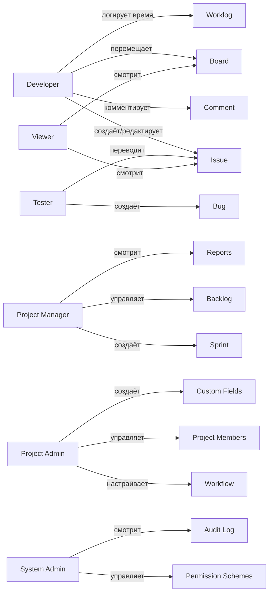

# User Stories и Use Cases Task Tracker

## Роли

- System Admin
- Project Admin
- Project Manager
- Developer
- Tester
- Viewer

---

## System Admin

| # | User Story | Acceptance Criteria |
|---|------------|---------------------|
| SA-1 | Я могу создать пользователя и назначить ему глобальную роль | Форма: username, email, password, is_admin. Пользователь сохраняется, хеш пароля argon2id. |
| SA-2 | Я могу деактивировать пользователя | Статус `is_active=false`, пользователь не может войти. Существующие задачи сохраняются. |
| SA-3 | Я могу управлять permission schemes | CRUD scheme + entries. Можно назначить grantee: user, role, group, project_role, anyone. |
| SA-4 | Я могу управлять workflow schemes | CRUD workflow scheme, привязка workflow к issue type. |
| SA-5 | Я могу управлять issue type schemes | CRUD issue type scheme, добавление/удаление типов задач. |
| SA-6 | Я могу управлять notification schemes | CRUD notification scheme, настройка событий и получателей. |
| SA-7 | Я могу просматривать audit log | Список действий с фильтрами по actor, entity_type, date range. |
| SA-8 | Я могу настраивать системные параметры | Название инстанса, email SMTP, rate limits, retention periods. |

---

## Project Admin

| # | User Story | Acceptance Criteria |
|---|------------|---------------------|
| PA-1 | Я могу создать проект | Форма: key, name, type, lead. Проект создаётся со всеми default schemes. |
| PA-2 | Я могу пригласить пользователя в проект и назначить роль | Выбор user + role. Роль влияет на permissions. |
| PA-3 | Я могу изменить роль участника проекта | Обновление `project_role_assignments`. |
| PA-4 | Я могу удалить участника из проекта | Удаление `project_members` + role assignments. |
| PA-5 | Я могу настроить workflow для проекта | Выбор workflow scheme + mapping issue type → workflow. |
| PA-6 | Я могу настроить issue types для проекта | Выбор issue type scheme. |
| PA-7 | Я могу настроить custom fields и экраны | Создание custom fields, contexts, screens. |
| PA-8 | Я могу создавать versions и components | CRUD versions/components. |
| PA-9 | Я могу архивировать проект | Статус `archived`, проект не отображается в списках, read-only. |
| PA-10 | Я могу удалить задачу из trash | Hard delete после soft delete. |

---

## Project Manager

| # | User Story | Acceptance Criteria |
|---|------------|---------------------|
| PM-1 | Я могу создавать и редактировать спринты | Форма: name, goal, start_date, end_date. Спринт появляется в backlog. |
| PM-2 | Я могу запускать и закрывать спринт | Start: state=active, end_date не в прошлом. Close: state=closed, незавершённые задачи перемещаются. |
| PM-3 | Я могу управлять backlog | Drag & drop приоритизация, добавление задач в спринт. |
| PM-4 | Я могу назначать задачи | Выбор assignee, автоматические уведомления. |
| PM-5 | Я могу просматривать отчёты | Velocity, burndown, cumulative flow, time tracking reports. |
| PM-6 | Я могу создавать релизы | Version → release, связь с fix versions задач. |
| PM-7 | Я могу создавать epic | Epic как задача типа Epic, child-задачи связываются. |

---

## Developer

|| # | User Story | Acceptance Criteria |
|---|---|------------|---------------------|
|| DEV-1 | Я могу создать задачу | Форма create issue: project, issue type, summary, description, priority, assignee, labels. |
|| DEV-2 | Я могу создать подзадачу | Parent issue + issue type Sub-task. |
|| DEV-3 | Я могу редактировать задачу | Поля, которые разрешены permission + screen. |
|| DEV-4 | Я могу перемещать задачу по workflow | Transition с проверками condition/validator/post-function. |
|| DEV-5 | Я могу перемещать задачу на kanban-доске | Drag & drop меняет status + rank. |
|| DEV-6 | Я могу добавлять комментарий | Rich text с mentions. |
|| DEV-7 | Я могу прикреплять файлы | Drag & drop, preview, inline-вставка. |
|| DEV-8 | Я могу логировать время | Диалог: time spent, remaining estimate, started_at, comment. Обновляются estimates. Панель в правой колонке и вкладка Worklog показывают logged time. |
|| DEV-9 | Я могу редактировать свой worklog | Диалог prefill с сохранёнными данными. |
|| DEV-10 | Я могу удалить свой worklog | Подтверждение, запись исчезает из списка, estimate не восстанавливается. |
|| DEV-11 | Я могу связывать задачи | Диалог link issue: type + target. |
|| DEV-12 | Я могу просматривать activity stream | История изменений, transitions, comments, worklogs. |
|| DEV-13 | Я могу клонировать задачу | Копия с префиксом `(Clone)`. |
|| DEV-14 | Я могу переместить задачу в другой проект | Пересчёт key, сохранение history, уведомления. |

---

## Tester

| # | User Story | Acceptance Criteria |
|---|------------|---------------------|
| TST-1 | Я могу создавать баги | Issue type Bug, авто-assignee по component lead. |
| TST-2 | Я могу переводить задачи в QA-статусы | Transition в статусы категории in_progress с QA-ролью. |
| TST-3 | Я могу просматривать тестовые задачи | Фильтр issueType IN (Bug, Story) + status. |

---

## Viewer

| # | User Story | Acceptance Criteria |
|---|------------|---------------------|
| VW-1 | Я могу просматривать список проектов | Только проекты, где у меня есть View Project. |
| VW-2 | Я могу открыть задачу | Read-only view всех полей, comments, activity. |
| VW-3 | Я могу просматривать доску | Карточки без возможности drag. |

---

## Кросс-ролевые сценарии

| # | Use Case | Участники | Шаги |
|---|----------|-----------|------|
| UC-1 | Создание проекта и первого спринта | System Admin / Project Admin | 1. Admin создаёт проект. 2. Назначает lead. 3. Lead приглашает команду. 4. Manager создаёт спринт. 5. Команда добавляет задачи. |
| UC-2 | Жизненный цикл задачи | Developer / Tester / Manager | 1. Создание Task. 2. Назначение assignee. 3. Переход In Progress. 4. Работа, комментарии, worklog. 5. Переход In Review. 6. Tester переводит в Done. |
| UC-3 | Kanban flow | Developer | 1. Открытие board. 2. Drag карточки из To Do в In Progress. 3. WIP limit подсвечивается. 4. Done. |
| UC-4 | Полнотекстовый поиск | Любой | 1. Ввод JQL. 2. Поиск по summary/description/comments. 3. Сохранение фильтра. 4. Добавление фильтра на dashboard. |
| UC-5 | Уведомление при mention | Developer | 1. Комментарий с `@ivan`. 2. WebSocket push + email + in-app notification. 3. Ivan видит уведомление. |
| UC-6 | Time tracking отчёт | Manager | 1. Открытие report. 2. Выбор project + date range. 3. Таблица time spent by user/issue. 4. Export CSV. |
| UC-7 | Автоматизация | Project Admin | 1. Создание правила: "если Bug создан и priority=High → assign to lead и отправить email". 2. Trigger срабатывает автоматически. |
| UC-8 | Roadmap | Manager | 1. Открытие roadmap view. 2. Timeline эпиков и версий. 3. Drag для изменения дат. |
| UC-9 | Release | Manager | 1. Создание version. 2. Привязка задач fixVersion. 3. Release version. 4. Отчёт release notes. |
| UC-10 | Trash recovery | Project Admin | 1. Soft delete задачи. 2. Просмотр trash. 3. Restore в течение 30 дней. 4. Hard delete. |

---

## Use Case диаграмма

---

## Покрытие API use cases

| Use Case | Endpoints |
|----------|-----------|
| UC-1 | POST /projects, POST /projects/{id}/members, POST /sprints |
| UC-2 | POST /issues, PUT /issues/{id}, POST /issues/{id}/transition, POST /comments, POST /worklogs |
| UC-3 | GET /boards/{id}, PUT /issues/{id} (status+rank) |
| UC-4 | GET /issues?jql=..., POST /filters, GET /filters/{id}/execute |
| UC-5 | POST /comments (с mentions), WebSocket notification event |
| UC-6 | GET /reports/time-tracking?project={id} |
| UC-7 | POST /automation-rules |
| UC-8 | GET /projects/{id}/roadmap |
| UC-9 | POST /projects/{id}/versions, PUT /versions/{id}/release |
| UC-10 | DELETE /issues/{id} (soft), GET /trash, POST /trash/{id}/restore |
## References

- `docs/TZ.md`
- `docs/UI_UX.md`
- `docs/PROJECT_ADMIN.md`
