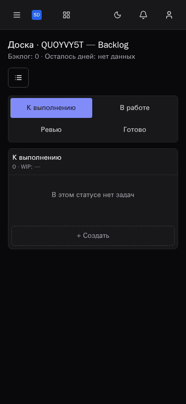
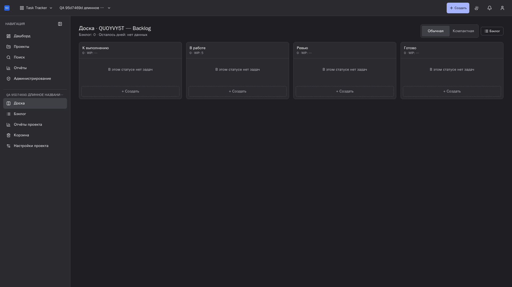
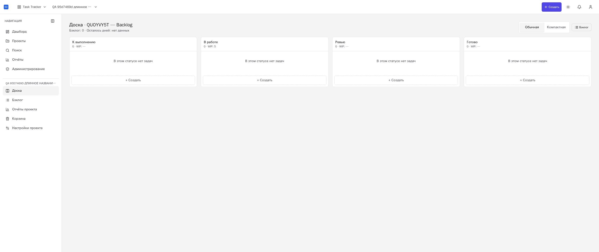
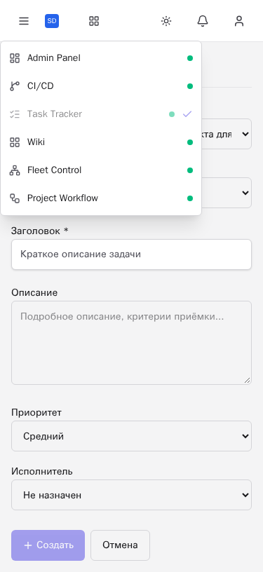

# Общая Шапка Task Tracker

Production-образ Task Tracker с `PlatformHeader` из Base #119. Реальные
Central Auth и API из изолированного Compose-проекта; запросы не подменялись.
Изображения full-page, собственный временный проект удалён штатным API.

- Шапка: 3 страницы × 3 темы × 11 ширин = 99 сочетаний, 320–2560 px.
- Высота 60 px, четыре слота, один переключатель, цели 44/40 px;
  нет перекрытий, page overflow и serious/critical axe в шапке.
- Runtime: шесть UI в продуктовом порядке, healthy; нет Auth/Java/Pulse,
  Task Tracker отмечен текущим. Меню непрозрачно, Escape возвращает фокус,
  outside touch закрывает меню и снимает native inert.
- Desktop project picker и создание, мобильное создание с `project_key`,
  уведомления, аккаунт, подтверждение глобального выхода и повторный вход.
- Отдельная полная матрица Task Tracker: 12 страниц во всех трёх темах,
  четыре viewport плюс 1024 px для issue detail. Без неожиданных внутренних
  scroller, page overflow и serious/critical axe; console/network errors — ноль.

`results.json` содержит машинные измерения шапки. `metadata.json` связывает
runtime image/config, Base ref, source и asset fingerprints. Эти значения
относятся к проверенному QA-образу, не к пользовательскому rollout.
Windows source fingerprints сохраняют байты checkout; Git может нормализовать LF.
Auth lifecycle, продуктовые API, backend и данные пользователя не изменялись.
Это срез A05/A09, не завершение всего платформенного релиза.

