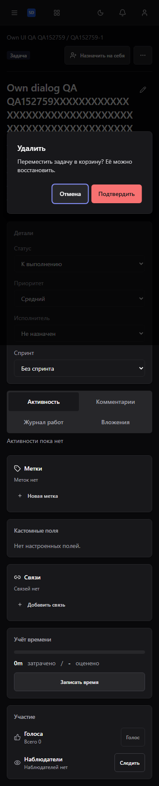
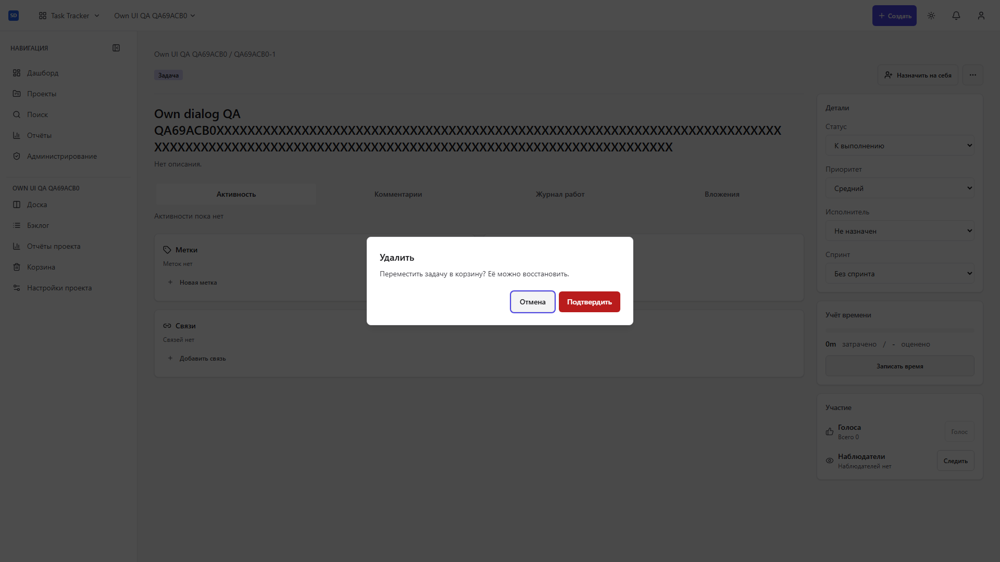
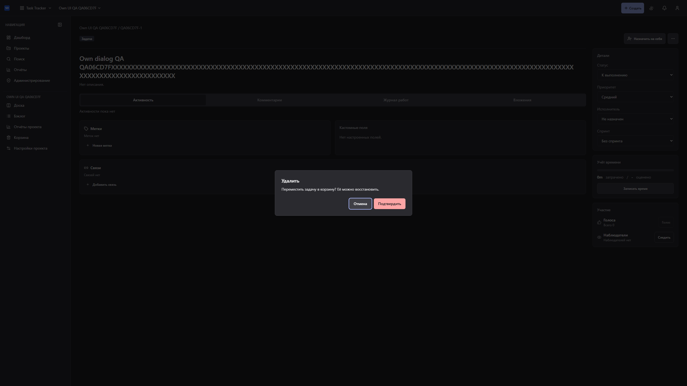
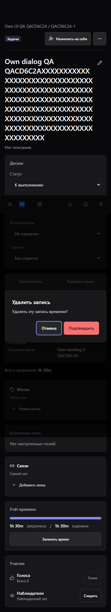
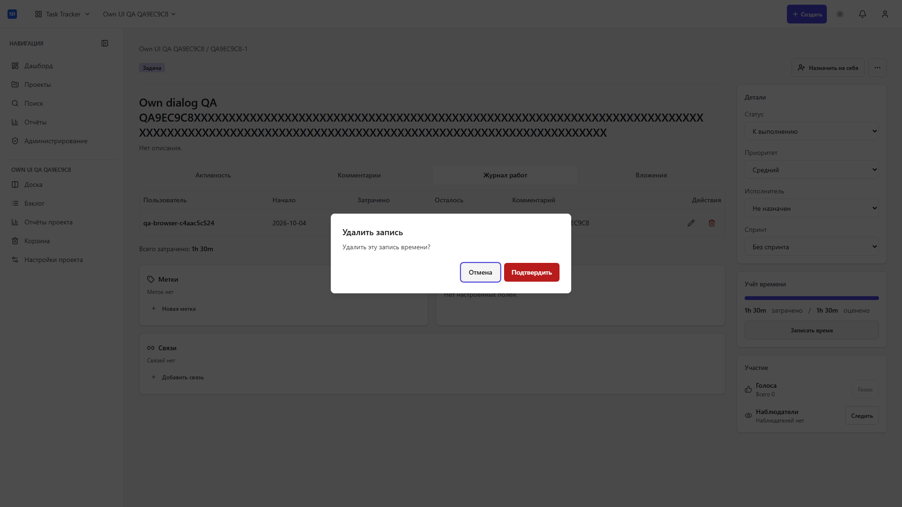
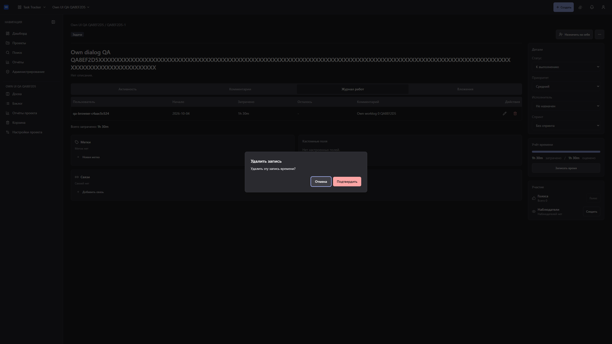

# Диалоги задач и worklog: keyboard, focus и async

Живой production QA от 2026-10-04: 30/30 сценариев прошли с настоящими
Central Auth, API и PostgreSQL во временном Compose, без подмены запросов.
Матрица удаления задачи/worklog: 375, 768, 1920 и 2560 px в dark/gray/light.
Проверены начальный focus, Tab, Escape, отмена, отсутствие переполнения,
возврат на кнопку меню задачи/исходной записи. После удаления worklog focus
переходит на вкладку журнала, включая удаление последней записи.

Реальные блокировки строк PostgreSQL проверяют pending: повторное подтверждение,
отмена и Escape не прерывают удаление. Реальный 404 собственной уже удалённой
записи показывает ошибку, которая не переносится в другое подтверждение.
Форма записи времени остаётся при Escape, закрытии и клике снаружи во время
INSERT, ожидающего FK-блокировку. Дробные 1.5h/0.25d сохраняются через UI/API
как 5400/7200 секунд. На снимках только собственные QA fixtures.

Источник UI: `c099841bebadf2a89b978840305b787cff5952d4`; Base UI: `9408802dfa978cba2f67162a49adca6f65851b01`.
Image: `sha256:5c3cd7f776797292e8713443a389a61456aa452f97c981c1434f35f463c060b4`; Playwright: `1.61.1`.
API — ранее собранный точный совместный кандидат; его pinned Base отличается
от опубликованного standalone pin UI. Этот QA не заменяет окончательную
совместную поставку Base/продуктов, PM/native/Pulse приёмку или три полных ревью.

264 frontend tests, typecheck, lint/semantic, build, OpenAPI drift/compatibility
и frozen lockfiles прошли. Регрессии: issue-detail, WorklogTab, LogWorkDialog.

